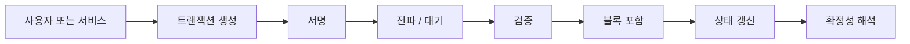

# 계정, 상태, 트랜잭션, 확정성

## 문서 목적

앞선 개요 문서들이 Web3를 `검증 가능한 신뢰 인프라`로 재정의했다면, 이 문서는 그 추상적 설명을 시스템 메커니즘 수준으로 내린다. 계정, 상태, 트랜잭션, 확정성을 한 문서에서 연결해, Web3의 신뢰가 실제로 어떻게 구현되는지 설명한다.

## 핵심 요약

- 계정은 권한과 책임이 시스템에 들어오는 진입점이다.
- 상태는 시스템이 현재 무엇을 사실로 보는지의 표현이다.
- 트랜잭션은 상태 변경 요청이며, 서명과 검증 절차를 거쳐 반영된다.
- 확정성은 결과를 언제부터 운영상 신뢰 가능한 상태로 볼지 정하는 기준이다.
- 따라서 이 네 요소는 단순한 블록체인 용어가 아니라, 검증 가능한 신뢰를 구현하는 기본 단위다.

## 상태 전이 관점에서 본 구조

## 계정은 무엇을 설명하는가

실무에서 중요한 것은 주소 자체보다 `누가 어떤 행위를 승인하고 누가 어떤 비용을 부담하며 누가 실행 책임을 지는가`다.

- 사용자 계정 또는 지갑
- 서비스가 위임받은 실행 권한
- 수수료를 대신 부담하는 주체
- 코드로 고정된 권한 정책

따라서 계정 모델은 단순 로그인 개념이 아니라 권한과 책임을 시스템에 주입하는 구조다.

## 상태와 트랜잭션

상태는 잔액, 소유권, 승인 여부, 정산 완료 여부처럼 시스템이 현재 사실로 인정하는 값이다. 트랜잭션은 그 상태를 바꾸기 위한 요청이다.

트랜잭션 흐름은 보통 아래 순서를 따른다.

1. 요청 생성
2. 서명
3. 전파
4. 검증
5. 블록 포함 또는 배치 반영
6. 상태 갱신
7. 확정성 판단

## 실무에서 자주 같이 설명하는 용어

- `nonce`: 순서 보장과 중복 방지 값
- `mempool`: 블록 포함 전 대기 구간
- `reorg`: 이미 본 결과가 뒤집힐 수 있는 위험
- `finality`: 제품과 운영이 결과를 믿기로 결정하는 기준

## 확정성은 기술 용어이면서 운영 정책이다

확정성은 체인별 기술 특성으로만 끝나지 않는다. 서비스는 아래 질문에 답해야 한다.

- 언제 사용자에게 성공으로 보여 줄 것인가
- 언제 정산을 완료 상태로 볼 것인가
- 언제 후속 업무를 자동 실행할 것인가

세미나에서는 `확정성 = 리스크 기반 운영 기준`이라고 설명하는 편이 이해가 빠르다.

## 세미나 관점 메모

- 이 문서는 1회차 기본기 세션에서 공통 언어를 맞추는 기준 문서로 쓰기 좋다.
- 발표에서는 합의 알고리즘 세부 비교보다 `누가 무엇을 바꾸고 언제 믿을 것인가`에 집중하는 편이 좋다.
- 후속 세션에서는 이 문서를 하이브리드 설계와 계정 추상화 논의의 선행 개념으로 사용한다.

## 선행 개념

- [Web3를 다시 정의하기: 탈중앙에서 검증가능성으로](/foundations/web3-overview)
- [신뢰 인프라의 진화: Bitcoin에서 RWA까지](/foundations/trust-infrastructure-evolution)

## 다음으로 읽을 문서

- [스마트컨트랙트는 정책 집행 계층이다](/foundations/smart-contracts-as-policy)
- [온체인, 오프체인, 앵커링, 하이브리드](/foundations/onchain-offchain-design-patterns)

## 관련 문서

- [하이브리드 아키텍처](/patterns/hybrid-architecture)
- [스마트월렛과 계정 추상화](/patterns/smart-wallet-and-account-abstraction)
