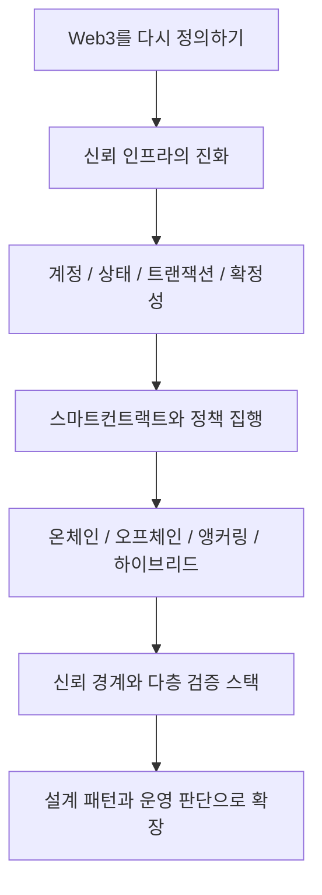

# Web3 개요와 신뢰 인프라

## 카테고리 목적

이 챕터는 Web3를 단순한 블록체인 입문 주제가 아니라 `검증 가능한 신뢰 인프라`로 이해하기 위한 서론이다. 목적은 용어를 나열하는 것이 아니라, Web3를 어떤 질문과 구조로 읽어야 하는지 공통 프레임을 세우는 데 있다.

이 챕터는 아래 다섯 가지를 먼저 정리한다.

- Web3를 왜 다시 정의해야 하는가
- 신뢰는 실제로 어디에 배치되는가
- 상태, 계정, 트랜잭션, 확정성은 어떤 운영 의미를 갖는가
- 스마트컨트랙트는 왜 정책 집행 계층으로 이해해야 하는가
- 온체인과 오프체인의 경계는 어떻게 설계해야 하는가

## 이 챕터의 핵심 프레임

Web3를 볼 때 이 챕터가 권장하는 기본 프레임은 아래 네 가지다.

1. 탈중앙화 자체보다 `검증 가능성`이 중요하다.
2. 블록체인은 모든 데이터를 담는 저장소보다 `상태와 규칙의 공통 기준점`에 가깝다.
3. 스마트컨트랙트는 코드 조각이 아니라 `정책 집행 레이어`다.
4. 실무적 승부처는 체인 선택보다 `신뢰 경계 설계`다.

## 구조 지도

## 권장 읽기 순서

1. [Web3를 다시 정의하기: 탈중앙에서 검증가능성으로](/foundations/web3-overview)
2. [신뢰 인프라의 진화: Bitcoin에서 RWA까지](/foundations/trust-infrastructure-evolution)
3. [계정, 상태, 트랜잭션, 확정성](/foundations/accounts-state-transactions-and-finality)
4. [스마트컨트랙트는 정책 집행 계층이다](/foundations/smart-contracts-as-policy)
5. [온체인, 오프체인, 앵커링, 하이브리드](/foundations/onchain-offchain-design-patterns)
6. [신뢰 경계와 다층 검증 스택](/foundations/trust-boundaries-and-verification-stack)

## 독자별 읽기 가이드

- 비개발자, 기획자
  - 1 -> 2 -> 5 -> 6 순서로 읽으면 전체 구조가 빠르게 잡힌다.
- 개발자, 아키텍트
  - 1 -> 3 -> 4 -> 5 -> 6 순서가 더 효율적이다.
- 세미나 발표 준비
  - 1과 2를 메시지 프레임으로 삼고, 3~6을 근거 문서로 사용하는 편이 좋다.

## 다음 카테고리

- [설계 패턴](/patterns/)
- [세미나](/seminar/)
