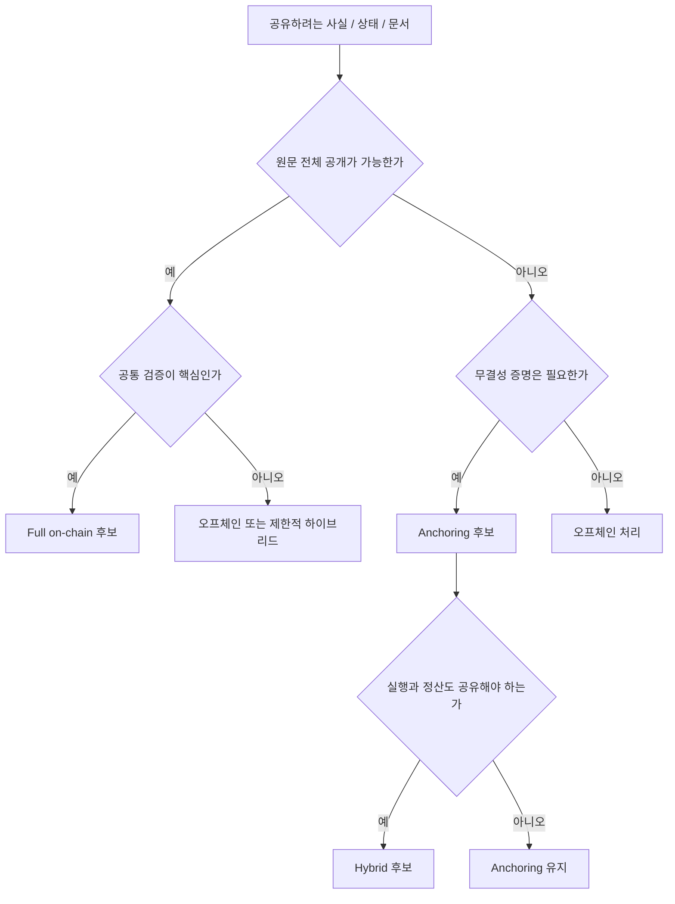

# 온체인, 오프체인, 앵커링, 하이브리드

## 핵심 관점

Web3 설계의 핵심 질문은 `무엇을 온체인에 둘 것인가`보다 `무엇을 어떤 방식으로 검증 가능하게 만들 것인가`에 가깝다. 이 문서는 온체인, 오프체인, 앵커링, 하이브리드 패턴을 기준으로 신뢰 경계 설계 방법을 정리한다.

## 핵심 요약

- 블록체인을 모든 데이터 저장소로 쓰는 것은 대부분의 실무 구조에서 비효율적이다.
- 중요한 것은 원문 저장 위치보다, 어떤 사실을 누구에게 어떻게 검증 가능하게 공개할 것인가다.
- 대표 패턴은 `Full on-chain`, `Anchoring`, `Hybrid` 세 가지로 나눠 볼 수 있다.
- 비용, 성능, 프라이버시, 감사 가능성, 책임 추적성의 trade-off로 패턴을 선택해야 한다.

## 패턴 비교

|패턴|설명|권장 상황|
|---|---|---|
|Full on-chain|로직과 핵심 데이터를 온체인 중심으로 처리|강한 투명성과 공통 검증이 우선일 때|
|Anchoring|원문은 오프체인에 두고 해시나 요약만 온체인에 기록|원문 보관 부담이 크지만 무결성 증명이 필요할 때|
|Hybrid|실행은 오프체인, 정산·권리·증빙은 온체인에 남김|성능, 프라이버시, 신뢰를 함께 요구할 때|

## 왜 Anchoring이 중요한가

많은 Web3 설명은 온체인과 오프체인을 이분법으로만 나누지만, 실무에서는 `Anchoring`이 매우 중요하다. 이는 원문 전체를 공유하지 않으면서도 아래를 가능하게 한다.

- 특정 문서나 이벤트가 존재했다는 사실 증명
- 사후 위변조 여부 확인
- 여러 주체 간 공통 기준점 제공
- 감사와 책임 추적의 최소 기준 확보

이 때문에 공급망, IoT, DPP, SSI, 데이터 스페이스, 기관 간 프로세스 동기화에서는 Full on-chain보다 Anchoring 또는 Hybrid가 현실적인 선택이 되는 경우가 많다.

## 판단 기준

아래 질문에 대한 답으로 패턴을 고르는 편이 좋다.

1. 위변조 방지가 핵심 요구인가
2. 다자간 신뢰 정렬이 필요한가
3. 사후 감사 추적이 필수인가
4. 원문 데이터를 모두 공유할 수 있는가
5. 비용과 지연을 감수할 가치가 있는가
6. 규제상 데이터 공개가 허용되는가

## 간단한 판단 프레임

## 실무적 해석

실제 설계에서는 아래 구성이 자주 나타난다.

- 민감한 원문 데이터는 오프체인 보관
- 상태 요약, 자산 권리, 승인 결과, 철회 여부는 온체인 기록
- 조회와 검색은 인덱서 또는 애플리케이션 서버 처리
- 감사 기준점은 이벤트 로그와 앵커 해시로 유지

이 구조의 장점은 성능과 프라이버시를 포기하지 않으면서, 필요한 수준의 검증 가능성을 확보할 수 있다는 점이다.

## 선행 개념

- [Web3를 다시 정의하기: 탈중앙에서 검증가능성으로](/foundations/web3-overview)
- [계정, 상태, 트랜잭션, 확정성](/foundations/accounts-state-transactions-and-finality)

## 다음으로 읽을 문서

- [신뢰 경계와 다층 검증 스택](/foundations/trust-boundaries-and-verification-stack)
- [하이브리드 아키텍처](/patterns/hybrid-architecture)

## 관련 문서

- [Enterprise Adoption Patterns](/operations/enterprise-adoption-patterns)
- [자산, 정산, 권리 구조](/patterns/assets-settlement-and-rights)
- [학습 경로와 메시지](/reference/learning-paths)
