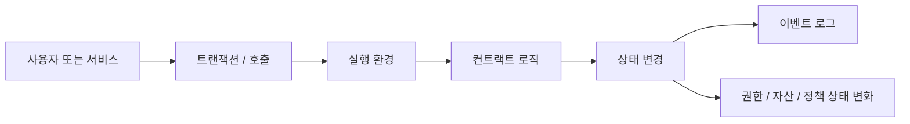

# 스마트컨트랙트는 정책 집행 계층이다

## 핵심 관점

스마트컨트랙트를 단순한 코드 배포나 자동화 스크립트로 이해하면 Web3의 정책 구조를 놓치게 된다. 이 문서는 스마트컨트랙트를 `공개 검증 가능한 정책 집행 레이어`로 설명하고, 상태 전이 규칙과 권한 구조가 어떻게 코드화되는지 정리한다.

## 핵심 요약

- 스마트컨트랙트는 상태 전이 규칙을 공통 기준으로 고정하는 정책 레이어다.
- 중요한 것은 코드 자체보다 `누가 어떤 상태를 어떤 조건에서 바꿀 수 있는가`다.
- 이벤트 로그는 오프체인 서비스와 연결되는 핵심 인터페이스다.
- 실무 설계에서는 권한 모델, 업그레이드 정책, 감사 추적, 비상 통제를 함께 봐야 한다.

## 정책 집행 관점의 실행 구조

## 왜 스마트컨트랙트를 정책 레이어로 봐야 하는가

스마트컨트랙트의 핵심은 `공개 검증 가능한 상태 머신`이라는 점이다. 특정 주체가 임의로 규칙을 바꾸거나 결과를 조작하지 못하게 하려면, 상태 전이 규칙이 공통으로 재현 가능해야 한다.

이 관점에서 보면 스마트컨트랙트는 단순한 프로그램이 아니라 아래를 집행한다.

- 어떤 행위를 허용할 것인가
- 어떤 자격과 권한을 인정할 것인가
- 어떤 순서와 조건에서 상태를 바꿀 것인가
- 어떤 이벤트를 공식 기록으로 남길 것인가

## 실무에서 더 중요한 질문

스마트컨트랙트를 설계할 때는 아래 질문이 더 중요하다.

- 어떤 함수가 누구에게 열려 있는가
- 어떤 상태를 읽고 갱신하는가
- 어떤 정책이 코드에 고정되고 어떤 정책이 외부 운영으로 남는가
- 어떤 이벤트를 남기고 누가 이를 소비하는가
- 실패 시 어디까지 롤백되는가
- 업그레이드와 긴급 정지는 어떤 통제 아래 있는가

## 권한 모델을 어떻게 볼 것인가

스마트컨트랙트는 권한 모델과 함께 설명해야 한다.

|모델|설명|실무적 의미|
|---|---|---|
|Owner|단일 관리자 중심의 통제|빠르지만 책임 집중과 단일 실패점 위험이 크다|
|RBAC|역할별 권한 분리|운영 조직과 책임 분리가 필요한 서비스에 적합하다|
|Multi-sig|여러 승인 주체의 합의 필요|고위험 자산, 비상 통제, 거버넌스 영역에 유리하다|

서비스 리스크가 높아질수록 권한을 세분화하고 감사 가능한 방식으로 남기는 것이 중요하다.

## 이벤트 로그와 오프체인 연결

스마트컨트랙트의 정책 집행은 온체인 안에서 끝나지 않는다. 많은 서비스는 이벤트 로그를 기준으로 오프체인 시스템을 움직인다.

대표적인 연결은 아래와 같다.

- 인덱서가 이벤트를 수집해 조회 API를 만든다.
- 백엔드가 상태 변화 이벤트를 읽고 후속 업무를 수행한다.
- 감사 시스템이 특정 정책 위반 여부를 추적한다.
- 분석 시스템이 자산 이동과 권한 변화를 모니터링한다.

따라서 이벤트 스키마는 단순 부가 기능이 아니라 정책 집행 결과를 외부 시스템에 전달하는 공식 인터페이스다.

## 설계 시 자주 보는 쟁점

- 업그레이드 가능한가, 불변으로 둘 것인가
- 관리자 권한은 얼마나 강한가
- 이벤트 스키마를 어떻게 고정할 것인가
- 이벤트 로그만으로 충분한 추적이 가능한가
- 비상 정지, 관리자 변경, 권한 위임은 어떤 절차를 따르는가
- 코드 밖의 운영 정책과 어떻게 정렬되는가

## 선행 개념

- [계정, 상태, 트랜잭션, 확정성](/foundations/accounts-state-transactions-and-finality)

## 다음으로 읽을 문서

- [온체인, 오프체인, 앵커링, 하이브리드](/foundations/onchain-offchain-design-patterns)
- [신뢰 경계와 다층 검증 스택](/foundations/trust-boundaries-and-verification-stack)

## 관련 문서

- [자산, 정산, 권리 구조](/patterns/assets-settlement-and-rights)
- [스마트컨트랙트 보안 운영](/operations/smart-contract-security-operations)
