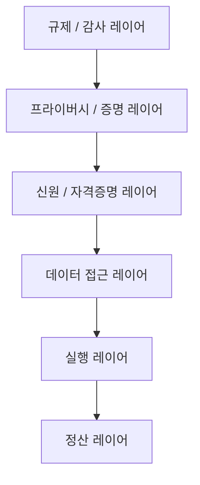

# 신뢰 경계와 다층 검증 스택

## 문서 목적

현재의 Web3를 `어떤 체인을 쓸 것인가`라는 질문만으로 설명하면 중요한 구조를 놓치게 된다. 이 문서는 Web3를 정산, 실행, 데이터, 신원, 프라이버시, 감사가 결합된 다층 검증 스택으로 설명하고, 실무에서 `신뢰 경계`를 어떻게 설계해야 하는지 입문 수준에서 정리한다.

## 핵심 요약

- 오늘날의 Web3는 퍼블릭 체인 대 프라이빗 체인의 단순 구도가 아니다.
- 핵심은 어떤 사실을 어느 레이어에 남기고, 누가 무엇을 검증할 수 있게 만들 것인가다.
- 정산, 실행, 데이터, 신원, 프라이버시, 규제·감사 레이어는 서로 다른 신뢰 요구를 가진다.
- 실무적으로는 단일 체인 선택보다 `trust boundary design`이 더 중요하다.

## 다층 검증 스택

각 레이어는 아래 질문을 담당한다.

|레이어|핵심 질문|
|---|---|
|정산|최종 상태와 자산 권리를 어디에 고정할 것인가|
|실행|어떤 로직과 정책이 상태를 바꾸는가|
|데이터 접근|누가 어떤 데이터를 조회하고 참조하는가|
|신원 / 자격증명|누가 어떤 자격과 권한을 갖는가|
|프라이버시 / 증명|무엇을 공개하지 않고도 증명할 수 있는가|
|규제 / 감사|어떻게 책임을 추적하고 감사할 수 있는가|

## 신뢰 경계란 무엇인가

신뢰 경계는 시스템에서 `어디까지를 공통 검증 영역으로 둘 것인가`, `어디부터를 개별 운영 영역으로 둘 것인가`를 나누는 선이다.

이 경계를 설계할 때는 아래 항목을 함께 봐야 한다.

- 어떤 상태는 모든 참여자가 동일하게 봐야 하는가
- 어떤 데이터는 민감해서 제한적으로만 공개해야 하는가
- 어떤 권한은 온체인 정책으로 통제하고, 어떤 권한은 조직 운영으로 통제할 것인가
- 문제가 생겼을 때 누가 책임을 지고 어디까지 추적 가능한가

## 왜 퍼블릭 vs 프라이빗 이분법으로는 부족한가

초기의 Web3 논의는 종종 `퍼블릭 체인인가`, `프라이빗 체인인가`의 선택 문제로 단순화되었다. 그러나 실제 구조는 훨씬 복합적이다.

- 퍼블릭 정산 레이어를 쓰더라도 민감 데이터는 오프체인에 둘 수 있다.
- 프라이빗 실행 환경을 쓰더라도 결과 요약과 증빙은 퍼블릭 체인에 남길 수 있다.
- DID/VC를 활용하면 계정 소유가 아니라 자격과 권한 단위로 검증 구조를 설계할 수 있다.
- ZK, MPC, TEE 같은 기술은 `무엇을 공개하지 않고도 증명할 것인가`라는 새로운 설계 옵션을 제공한다.

즉 중요한 것은 체인의 유형이 아니라, 각 레이어를 어떻게 결합해 신뢰를 분할하고 검증을 배치하느냐이다.

## 실무에서 보는 대표 구조

실무에서는 아래와 같은 하이브리드 구성이 자주 등장한다.

- 정산성과 공통 기준점은 퍼블릭 체인 사용
- 민감 데이터와 고비용 연산은 오프체인 또는 제한된 실행 환경 사용
- 자격과 권한은 DID/VC 또는 별도 인증 체계와 결합
- 프라이버시 요구는 ZK, MPC, TEE, 선택적 공개 구조로 보완
- 감사와 책임 추적은 이벤트 로그, 앵커, 증명, 운영 기록을 결합

## 실무 질문 체크리스트

아래 질문에 답하지 못하면 구조가 기술적으로 돌아가더라도 운영 신뢰를 확보하기 어렵다.

1. 최종 상태는 어디에 고정되는가
2. 원문 데이터는 어디에 보관되는가
3. 누가 정책을 바꾸고 누가 이를 승인하는가
4. 어떤 자격과 권한이 필요한가
5. 어떤 사실을 외부에 증명해야 하는가
6. 장애, 사고, 분쟁 시 어떤 기록이 책임 추적의 기준이 되는가

## 세미나 관점 메모

- 이 문서는 `퍼블릭 vs 프라이빗`의 이분법을 깨고 싶을 때 유용하다.
- 기술팀에게는 아키텍처 설명 문서로, 비기술 청중에게는 설계 판단 프레임으로 활용할 수 있다.
- 이후 `patterns/` 챕터와 `operations/` 챕터로 넘어가는 연결 문서 역할을 한다.

## 선행 개념

- [Web3를 다시 정의하기: 탈중앙에서 검증가능성으로](/foundations/web3-overview)
- [온체인, 오프체인, 앵커링, 하이브리드](/foundations/onchain-offchain-design-patterns)

## 다음으로 읽을 문서

- [하이브리드 아키텍처](/patterns/hybrid-architecture)
- [DID, VC, 정책 자동화](/patterns/did-vc-and-policy)
- [Security, Governance, Scalability](/operations/security-governance-and-scalability)

## 관련 문서

- [스마트월렛과 계정 추상화](/patterns/smart-wallet-and-account-abstraction)
- [Enterprise Adoption Patterns](/operations/enterprise-adoption-patterns)
