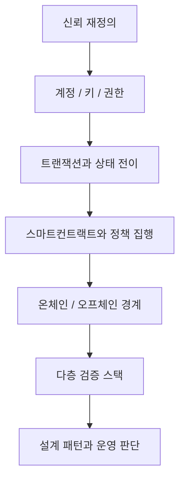

# Web3를 다시 정의하기: 탈중앙에서 검증가능성으로

## 문서 목적

Web3를 단순히 `탈중앙화 기술`, `암호화폐 생태계`, `블록체인 응용` 정도로 설명하면 현재 시장과 실무 구조를 정확히 읽기 어렵다. 이 문서는 Web3를 `검증 가능한 신뢰 인프라`로 다시 정의하고, 이후 챕터 전체를 읽기 위한 공통 프레임을 제시한다.

## 핵심 요약

- Web3의 핵심은 탈중앙화 자체보다 `검증 가능성`에 있다.
- 신뢰는 제거된 것이 아니라 기관, 플랫폼, 운영자에게서 프로토콜, 키, 증명, 거버넌스 구조로 재배치되었다.
- 블록체인의 본질은 절대적 불변성보다 `tamper-evident`, 즉 조작을 어렵게 하고 흔적을 드러내는 공통 원장 구조에 가깝다.
- 현재의 Web3는 퍼블릭 체인 대 프라이빗 체인의 이분법보다, 정산·실행·데이터·신원·프라이버시·감사가 결합된 다층 검증 스택으로 읽는 편이 더 정확하다.
- 따라서 실무적 질문도 `무엇을 온체인에 둘 것인가`보다 `무엇을 어떤 방식으로 검증 가능하게 만들 것인가`로 바뀐다.

## 문제는 탈중앙화가 아니라 신뢰 설계다

Web3는 자주 `중앙 서버를 없애는 기술`로 설명되지만, 실제로 더 중요한 질문은 아래와 같다.

- 누가 자산의 소유권을 증명하는가
- 누가 상태 변경 규칙을 결정하는가
- 누가 거래와 실행 기록을 검증하는가
- 여러 주체가 같은 사실과 사건을 어떻게 공유하는가
- 사후 책임 추적과 감사는 어디에서 가능한가

이 관점에서 보면 Web3는 `탈중앙화된 네트워크`보다 `검증 가능한 다자 신뢰 인프라`라는 표현이 더 정확하다.

## 신뢰는 사라지지 않고 이동한다

Web3가 만들어 내는 변화는 신뢰의 소멸이 아니라 신뢰의 이동이다.

|기존 구조|Web3 구조에서 이동하는 지점|
|---|---|
|플랫폼 운영자|프로토콜 규칙, 합의, 정책 로직|
|중앙 데이터베이스|공유 가능한 상태와 이벤트 기록|
|단일 인증기관|키, 계정, 자격증명, 검증 흐름|
|수작업 승인 절차|스마트컨트랙트와 자동 집행 규칙|
|폐쇄형 내부 감사|외부 검증 가능한 기록과 감사 trail|

즉 Web3는 `기관 신뢰`를 `프로토콜 신뢰`로 완전히 대체하는 것이 아니라, `기관·프로토콜·운영·거버넌스` 사이의 신뢰 경계를 다시 그리는 흐름이다.

## Bitcoin과 Ethereum은 무엇을 바꿨는가

Bitcoin은 금융기관 없이 P2P 전자현금을 가능하게 하고, 작업증명 기반 타임스탬프 체인으로 이중지불 문제를 해결하려는 시도에서 출발했다. 이 시점의 핵심은 결제 신뢰를 중앙기관에서 프로토콜과 참여자 검증 구조로 이동시키는 것이었다.

Ethereum은 이 범위를 결제에서 실행 환경으로 확장했다. 스마트컨트랙트, 토큰, DAO, 탈중앙 애플리케이션은 단순한 송금 네트워크가 아니라 `프로그램 가능한 경제 인프라`의 가능성을 열었다. 이때부터 신뢰 문제는 결제 승인 여부를 넘어 아래 영역으로 넓어졌다.

- 코드 실행을 신뢰할 수 있는가
- 권한 모델은 어떻게 설계되는가
- 업그레이드와 비상 통제는 누가 담당하는가
- 온체인과 오프체인 시스템은 어떤 기준으로 연결되는가

## Web3를 볼 때 자주 생기는 오해

|오해|더 적절한 해석|
|---|---|
|Web3는 곧 암호화폐다|암호화폐는 한 요소이며, 더 넓게는 상태·권한·실행 구조의 재설계다|
|탈중앙화가 높을수록 항상 좋다|비용, 속도, 프라이버시, 운영성, 규제 적합성과 함께 trade-off로 봐야 한다|
|모든 데이터를 온체인에 올려야 한다|실무에서는 온체인 기록보다 검증 가능한 앵커링과 감사 기준점이 더 중요할 때가 많다|
|퍼블릭 체인 또는 프라이빗 체인 중 하나를 고르면 된다|현재 시장은 정산, 실행, 신원, 프라이버시, 감사가 결합된 하이브리드 스택으로 이동했다|
|코드만 안전하면 전체 구조도 안전하다|브리지, 지갑, 키 관리, 운영 권한, 거래소, 내부 통제까지 함께 봐야 한다|

## 현재의 중심 키워드는 검증 가능성이다

오늘날 Web3를 이해할 때 중요한 키워드는 `decentralization`보다 `verifiability`다. 이 변화는 몇 가지 시장 현실과 연결된다.

- 제도권 금융과 규제 환경은 완전 무허가 구조보다 검증 가능하고 감사 가능한 구조를 선호한다.
- 기업형 활용은 모든 데이터 공개보다 선택적 공개, 프라이버시, 책임 추적성을 더 중요하게 본다.
- DID, VC, ZK, L2, 오라클, 인덱싱, 토큰화 인프라는 모두 `검증 가능성`을 다른 방식으로 확장하는 도구다.

따라서 Web3를 설명할 때 `탈중앙 서비스`라는 추상적 표현보다 `검증 가능한 상태, 권한, 자산, 이벤트를 공유하는 인프라`라는 표현이 더 실무적이다.

## 이 챕터를 읽는 기본 프레임

이후 문서들은 아래 질문을 중심으로 읽는 것이 좋다.

1. 상태는 어디에 기록되는가
2. 권한은 누가 어떻게 행사하는가
3. 정책은 어떤 코드와 규칙으로 집행되는가
4. 검증은 누구에게 개방되는가
5. 어떤 데이터가 온체인에 남고 무엇이 오프체인에 머무는가
6. 신뢰 경계와 책임 경계는 어디에 놓이는가

## 구조 지도

## 세미나 관점 메모

- 발표의 첫 문장은 `웹3는 탈중앙 기술이 아니라 검증 가능한 신뢰 인프라다`처럼 프레임 전환형으로 시작하는 편이 좋다.
- 비개발자에게는 `소유권`, `상태`, `규칙`, `책임 추적` 관점이 효과적이다.
- 개발자에게는 철학보다 `상태`, `정책`, `경계`, `감사 가능성` 순으로 설명하는 편이 빠르다.

## 다음으로 읽을 문서

- [신뢰 인프라의 진화: Bitcoin에서 RWA까지](/foundations/trust-infrastructure-evolution)
- [계정, 상태, 트랜잭션, 확정성](/foundations/accounts-state-transactions-and-finality)
- [신뢰 경계와 다층 검증 스택](/foundations/trust-boundaries-and-verification-stack)

## 관련 문서

- [온체인, 오프체인, 앵커링, 하이브리드](/foundations/onchain-offchain-design-patterns)
- [하이브리드 아키텍처](/patterns/hybrid-architecture)
- [Enterprise Adoption Patterns](/operations/enterprise-adoption-patterns)
