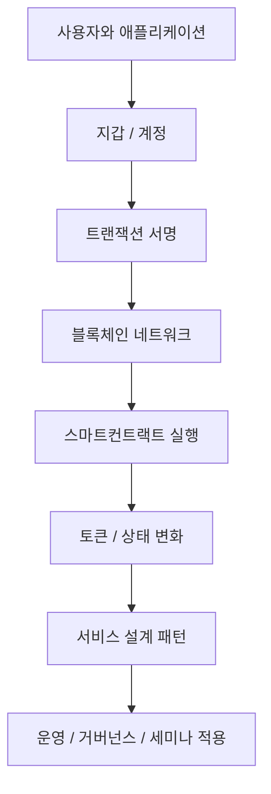

# Web3 개요와 철학

## 문서 목적

Web3가 무엇인지 한 문장으로 단순화하기보다, 어떤 문제의식과 구조적 선택의 조합으로 이해해야 하는지 정리한다.

## 핵심 요약

- Web3는 인터넷 서비스의 소유권, 실행, 신뢰 형식을 재설계하려는 시도다.
- 핵심 키워드는 탈중앙화 자체보다 `검증 가능성`, `자산성`, `프로토콜 기반 조합 가능성`에 있다.
- 모든 서비스가 완전히 온체인으로 가야 하는 것은 아니며, 실제 설계는 대부분 하이브리드다.
- 따라서 Web3를 이해할 때는 이념보다도 상태, 계정, 실행, 검증, 거버넌스의 구조를 함께 봐야 한다.
- 이 문서는 세미나 1단계의 출발점으로 쓰이도록, 이후 문서와 느슨하게 연결되는 큰 그림만 정리한다.

## 구조 지도

## 왜 Web3가 등장했는가

기존 웹 서비스는 빠른 개발과 높은 사용자 경험을 제공했지만, 데이터와 실행 권한이 소수의 플랫폼에 집중되는 구조를 자주 만들었다. Web3는 이 문제를 단순히 `중앙 서버를 없애자`로 접근하지 않고, 아래 질문으로 다시 풀어 보려는 흐름이다.

- 누가 자산의 소유권을 증명하는가
- 누가 상태 변경 규칙을 결정하는가
- 누가 거래와 실행 기록을 검증하는가
- 여러 서비스가 같은 자산과 상태를 공유할 수 있는가

## Web3를 볼 때 자주 생기는 오해

|오해|더 적절한 해석|
|---|---|
|Web3는 곧 암호화폐다|암호화폐는 한 요소이고, 더 넓게는 실행과 소유권 구조의 재설계다|
|모든 것을 온체인에 올려야 한다|실제 시스템은 보통 온체인과 오프체인의 역할을 나눠 설계한다|
|탈중앙화가 높을수록 항상 좋다|비용, 속도, 운영성, 규제 적합성과 함께 trade-off로 봐야 한다|
|주제가 너무 많아 한 번에 분류해야 한다|상위 챕터는 넓게 두고, 세부 주제는 문서 단위로 확장하는 편이 운영에 유리하다|

## 세미나 관점 메모

- 발표 초반에는 `탈중앙화`보다 `검증 가능한 상태와 자산`이라는 표현이 이해를 돕는다.
- 청중이 비개발자라면 Web2와의 비교를 `데이터 소유`, `실행 규칙`, `플랫폼 종속성` 중심으로 설명하는 편이 좋다.
- 개발자 대상 세미나라면 철학보다도 계층 구조와 상태 전이 모델을 먼저 제시하는 편이 낫다.

## 다음으로 읽을 문서

- [계정, 상태, 트랜잭션, 확정성](/foundations/accounts-state-transactions-and-finality)
- [온체인 vs 오프체인 설계 패턴](/foundations/onchain-offchain-design-patterns)
- [읽기 순서와 핵심 메시지](/seminar/reading-path-and-core-messages)

## 관련 문서

- [하이브리드 아키텍처](/patterns/hybrid-architecture)
- [Enterprise Adoption Patterns](/operations/enterprise-adoption-patterns)
