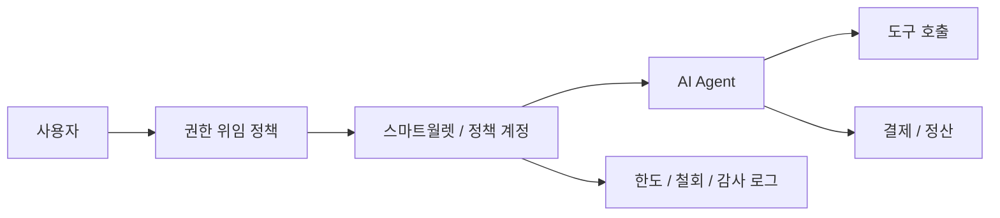

# 에이전트 권한과 지갑

AI 에이전트가 실제 서비스를 호출하고 비용을 지불하며 계약을 실행하려면, 단순 API 키보다 정교한 권한 모델이 필요하다. 핵심은 에이전트에게 지갑을 주는 것이 아니라, 어떤 범위의 권한을 어떤 조건으로 위임하고 언제 철회할 수 있는지를 설계하는 것이다.

## 핵심 가설

에이전트 시대의 지갑은 자산 보관 도구보다 `정책 실행 계정`에 가까워질 가능성이 높다. 계정 추상화, 세션 키, 지출 한도, 시간 제한, 승인 정책, 복구 정책이 결합되어야 한다.

## 가능한 구조

## 설계 질문

|질문|의미|
|---|---|
|에이전트가 직접 서명하는가, 사용자를 대신해 제한 권한만 행사하는가|책임 소재와 키 관리 방식이 달라진다|
|지출 한도와 시간 제한은 어디에 둘 것인가|스마트월렛, 백엔드 정책, 결제 시스템 간 역할을 나눠야 한다|
|권한 철회는 즉시 반영되는가|오프체인 캐시와 온체인 상태 사이의 지연을 관리해야 한다|
|행동 로그는 어디까지 남길 것인가|프라이버시와 감사 가능성의 균형이 필요하다|

## 리스크

- 에이전트 키 탈취 시 자산 손실 범위가 커질 수 있다.
- 자동 실행이 많아질수록 승인 피로와 책임 불명확성이 커진다.
- 온체인 정책만으로는 오프체인 도구 접근 권한을 충분히 통제하기 어렵다.

## 연결 문서

- [스마트월렛과 계정 추상화](/patterns/smart-wallet-and-account-abstraction)
- [DID, VC, 정책 자동화](/patterns/did-vc-and-policy)
- [검증 가능한 에이전트 행동 기록](/lab/verifiable-agent-activity)
