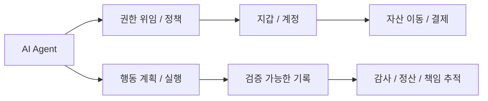

# AI + Web3 Convergence

AI와 Web3를 막연한 미래 서사가 아니라, 실제로 접점이 생기는 문제 구조를 중심으로 정리한다.

## 핵심 요약

- AI는 추론과 자동화를, Web3는 자산성과 검증 가능성을 더 강하게 다룬다.
- 두 기술을 함께 볼 때는 `에이전트의 권한`, `지불과 정산`, `신원과 자격`, `행동 기록의 검증 가능성`이 핵심 접점이 된다.
- 모든 AI 서비스가 Web3를 필요로 하지는 않으며, 반대로 모든 Web3 서비스가 AI를 필요로 하지도 않는다.
- 따라서 결합 여부는 기술 유행이 아니라 문제 적합성으로 판단해야 한다.

## 접점 구조

## 유효한 접점

### 1. 에이전트의 권한 위임

에이전트가 실제로 돈을 쓰거나 계약을 실행하려면, 누가 어느 범위까지 권한을 위임했는지가 명확해야 한다. 이 지점에서 지갑, 스마트월렛, 정책 기반 실행, 신원 증명 구조가 중요해진다.

### 2. 프로그램 가능한 지불과 정산

AI 서비스가 다른 서비스나 도구를 호출하고 비용을 정산해야 한다면, 소액 결제 또는 자동 정산 구조가 필요할 수 있다. 이때 토큰화된 자산이나 온체인 결제 레이어가 의미를 가질 수 있다.

### 3. 검증 가능한 행동 기록

에이전트가 어떤 입력으로 어떤 결정을 내렸고 어떤 자산 이동을 유발했는지 검증 가능한 기록이 필요할 수 있다. 모든 추론 과정을 온체인화할 필요는 없지만, 핵심 이벤트를 검증 가능하게 남기는 구조는 실험 가치가 있다.

### 4. 신원과 자격

특정 에이전트가 어떤 조직에 속하고 어떤 자격과 권한을 갖는지 증명해야 하는 경우, DID, VC, 서명 기반 증명이 결합될 수 있다.

## 실험 가설

|가설|검증 질문|
|---|---|
|에이전트는 지갑보다 정책 계정이 필요하다|사용자가 에이전트에게 어떤 권한을 위임했고 언제 철회할 수 있는가|
|AI 행동 기록은 전체 추론 로그보다 핵심 이벤트 증명이 중요하다|어떤 행동만 증명 가능하게 남겨도 감사와 분쟁 대응이 가능한가|
|온체인 결제는 모든 AI 호출보다 서비스 간 정산에서 먼저 의미가 있다|소액 결제, 구독, 크레딧, 후불 정산 중 어디에 가장 적합한가|
|DID/VC는 사람뿐 아니라 에이전트의 자격 표현에도 쓰일 수 있다|에이전트의 소유자, 역할, 도구 접근 범위를 어떻게 증명할 것인가|

## 과장되기 쉬운 지점

|과장된 주장|더 현실적인 해석|
|---|---|
|AI 에이전트는 모두 온체인 경제 위에서 돌아간다|일부 지불/정산 시나리오에만 온체인 구조가 유효할 수 있다|
|블록체인이 AI의 진실성을 자동 보장한다|모델 품질과 사실성은 별도 문제이며, 기록과 권한만 더 잘 다룰 수 있다|
|토큰이 있으면 에이전트 생태계가 자동으로 형성된다|권한, 정책, 책임 구조가 먼저 정리되어야 한다|

## 선행 개념

- [DID, VC, 정책 자동화](/patterns/did-vc-and-policy)
- [Security, Governance, Scalability](/operations/security-governance-and-scalability)
- [Enterprise Adoption Patterns](/operations/enterprise-adoption-patterns)

## 다음으로 읽을 문서

- [에이전트 권한과 지갑](/lab/agent-wallet-permissions)
- [검증 가능한 에이전트 행동 기록](/lab/verifiable-agent-activity)

## 관련 문서

- [Lab](/lab/)
- [용어사전](/reference/glossary)
