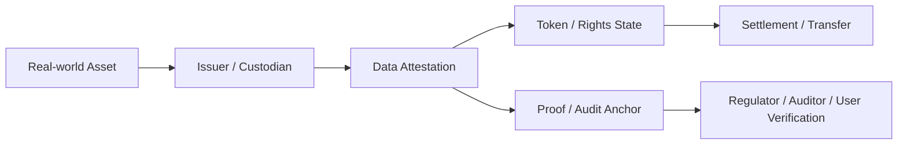

# RWA와 데이터 증명

RWA는 현실 세계 자산을 단순히 토큰으로 발행하는 문제가 아니다. 핵심은 자산의 존재, 권리, 담보, 평가, 정산, 규제 상태를 어떤 방식으로 검증 가능하게 연결할 것인가다.

## 핵심 가설

RWA의 실무적 난점은 토큰 표준보다 `오프체인 사실을 누가 보증하고 어떻게 갱신하며 어떤 감사 기준으로 검증할 것인가`에 있다.

## 필요한 증명

|증명 대상|질문|주요 리스크|
|---|---|---|
|자산 존재|해당 자산이 실제로 존재하는가|허위 발행, 중복 담보|
|권리 관계|누가 어떤 권리를 갖는가|소유권 분쟁, 법적 불일치|
|평가 정보|가치 산정은 어떤 기준인가|가격 조작, 시점 차이|
|상태 변화|담보, 처분, 정산 상태가 바뀌었는가|오프체인 지연, 누락|
|감사 기록|누가 어떤 기준으로 확인했는가|책임 소재 불명확|

## 가능한 구조

## 설계 질문

1. 원자산의 존재와 권리 상태를 누가 확인하는가
2. 데이터 갱신 주기는 얼마나 자주 필요한가
3. 토큰 보유와 법적 권리는 어떻게 연결되는가
4. 감사 가능한 데이터와 비공개 데이터는 어떻게 나눌 것인가
5. 자산 상태가 바뀌었을 때 온체인 상태를 어떻게 동기화할 것인가

## 연결 문서

- [자산, 정산, 권리 구조](/patterns/assets-settlement-and-rights)
- [온체인, 오프체인, 앵커링, 하이브리드](/foundations/onchain-offchain-design-patterns)
- [ZK와 선택적 공개](/lab/zk-selective-disclosure)
