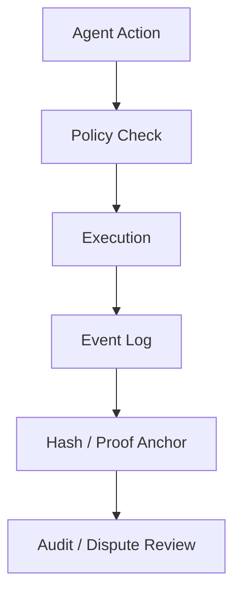

# 검증 가능한 에이전트 행동 기록

AI 에이전트가 자산, 권한, 외부 도구를 다루기 시작하면 `무엇을 했는가`, `누가 승인했는가`, `어떤 정책 아래 실행되었는가`를 사후 검증할 수 있어야 한다. 모든 추론 과정을 온체인에 올리는 것은 비현실적이지만, 핵심 행동 이벤트를 검증 가능하게 남기는 구조는 실험 가치가 있다.

## 핵심 가설

에이전트 행동 기록은 전체 사고 과정을 보존하는 것이 아니라, 책임 추적에 필요한 `권한`, `입력 요약`, `실행 결과`, `정책 버전`, `승인 주체`를 검증 가능한 이벤트로 남기는 방향이 현실적이다.

## 기록 대상

|기록 대상|예시|검증 목적|
|---|---|---|
|권한 위임|사용자가 에이전트에 부여한 역할, 한도, 기간|행동의 정당성 확인|
|정책 버전|실행 당시 적용된 승인 규칙|사후 판단 기준 확보|
|행동 이벤트|결제, 계약 호출, 데이터 전송, 도구 실행|책임 추적|
|결과 요약|성공, 실패, 재시도, 보상 처리|운영 상태 확인|
|증빙 앵커|로그 해시, 배치 루트, 서명|위변조 검증|

## 가능한 구조

## 검증 질문

1. 어떤 행동은 반드시 사용자가 승인해야 하는가
2. 어떤 행동은 정책에 따라 자동 실행해도 되는가
3. 로그 원문은 어디에 보관하고 어떤 요약만 공개할 것인가
4. 행동 기록이 조작되지 않았음을 어떻게 증명할 것인가
5. 개인정보와 기업 내부정보를 노출하지 않고도 충분한 감사가 가능한가

## 연결 문서

- [에이전트 권한과 지갑](/lab/agent-wallet-permissions)
- [온체인, 오프체인, 앵커링, 하이브리드](/foundations/onchain-offchain-design-patterns)
- [Security, Governance, Scalability](/operations/security-governance-and-scalability)
