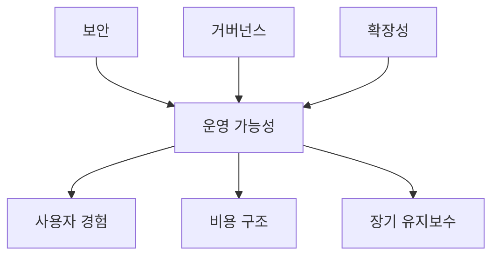

# Security, Governance, Scalability

## 문서 목적

Web3 시스템이 왜 기술적으로 가능하다는 것만으로 충분하지 않은지, 그리고 실제 운영 단계에서 어떤 trade-off를 관리해야 하는지 설명한다.

## 핵심 요약

- 보안은 코드 취약점만이 아니라 키 관리, 권한 구조, 업그레이드 정책까지 포함한다.
- 거버넌스는 의사결정 절차와 집행 책임을 연결하는 운영 구조다.
- 확장성은 TPS 숫자보다도 비용, 지연, 데이터 가용성, 인덱싱 복잡도까지 함께 봐야 한다.
- 세 축은 서로 독립적이지 않으며, 하나를 강화하면 다른 축의 비용이 늘어나는 경우가 많다.

## 세 축의 관계

## 보안

Web3에서 보안은 다음 층위를 함께 본다.

- 스마트컨트랙트 코드 안전성
- 관리자 권한과 멀티시그 구조
- 키 분실과 복구 전략
- 브리지와 외부 의존성
- 오라클, 인덱서, 프런트엔드 같은 주변 계층

즉, 온체인 코드만 안전해도 전체 서비스가 안전하다고 볼 수 없다.

## 거버넌스

거버넌스는 단순 투표 UI가 아니라, 누가 제안하고 누가 승인하며 누가 실행하는지의 체계다. 실제 운영에서는 아래 질문이 중요하다.

- 긴급 상황에서 누가 빠르게 개입하는가
- 토큰 홀더와 운영팀 권한은 어떻게 나누는가
- 업그레이드 권한은 어떤 절차를 거치는가
- 감사 가능한 기록을 어떻게 남기는가

## 확장성

확장성을 볼 때는 아래 요소를 함께 고려해야 한다.

- 실행 비용
- 데이터 가용성 비용
- 최종성까지 걸리는 시간
- 브리지 또는 메시지 전달 비용
- 인덱싱과 분석 복잡도

## 운영 관점 메모

- 발표에서는 `탈중앙화의 이상`보다 `운영 가능한 시스템을 만들기 위한 세 축`으로 설명하는 편이 현실적이다.
- 기업 대상 세미나에서는 보안과 거버넌스를 `책임소재`와 `통제권한` 문제로 번역해 설명하면 이해가 빠르다.
- 확장성은 단순 처리량 비교표보다도 비용과 운영성의 함수로 설명하는 것이 낫다.
- 세미나 7~8단계의 공통 배경 문서로 쓰기 적합하다.

## 선행 개념

- [스마트컨트랙트와 정책 모델](/foundations/smart-contracts-as-policy)
- [멀티체인과 상호운용](/patterns/multichain-and-interoperability)

## 다음으로 읽을 문서

- [스마트컨트랙트 보안 운영](/operations/smart-contract-security-operations)
- [DAO-lite 거버넌스](/operations/dao-lite-governance)

## 관련 문서

- [계정, 상태, 트랜잭션, 확정성](/foundations/accounts-state-transactions-and-finality)
- [읽기 순서와 핵심 메시지](/seminar/reading-path-and-core-messages)
