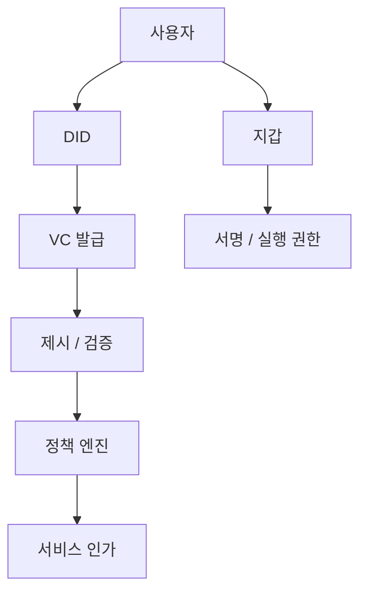

# DID, VC, 정책 자동화

## 문서 목적

`신원 증명과 서비스 인가를 어떤 정책으로 자동화할 것인가`라는 질문을 중심으로 DID, VC, SSI를 정리한다.

## 핵심 요약

- DID는 식별자 체계, VC는 자격 증명 형식, SSI는 이를 운영하는 모델로 이해하는 편이 명확하다.
- 서비스 설계에서는 발급, 제시, 검증, 폐기 흐름을 정책 레이어와 함께 설계해야 한다.
- 지갑과 계정만으로는 조직 소속, 자격, 역할 기반 접근 제어를 충분히 설명하기 어렵다.
- 공공·기업 서비스 문맥에서는 신원과 권한을 분리해서 모델링하는 것이 중요하다.

## 관계 지도

## 구성 요소를 구분해서 보기

DID는 식별자, VC는 증명 형식, SSI는 사용자 중심 운영 모델이다. 서비스는 보통 아래처럼 나눈다.

- 자산 이동과 실행: 지갑과 계정
- 신원 식별: DID
- 자격 증명: VC
- 접근 정책: 발급 조건, 검증 규칙, 만료 및 폐기 규칙

## 왜 이 구분이 중요한가

서비스는 아래 요구를 동시에 가진다.

- 자산 소유권을 증명해야 한다
- 특정 조직 구성원인지 증명해야 한다
- 특정 역할 또는 자격을 증명해야 한다
- 개인정보는 최소한만 노출해야 한다

지갑 서명만으로는 마지막 세 문제를 깔끔하게 풀기 어렵다. 세미나 3단계는 이 지점을 다룬다.

## 선행 개념

- [하이브리드 아키텍처](/patterns/hybrid-architecture)

## 다음으로 읽을 문서

- [스마트월렛과 계정 추상화](/patterns/smart-wallet-and-account-abstraction)
- [Enterprise Adoption Patterns](/operations/enterprise-adoption-patterns)

## 관련 문서

- [AI + Web3 Convergence](/lab/ai-and-web3-convergence)
- [읽기 순서와 핵심 메시지](/seminar/reading-path-and-core-messages)
