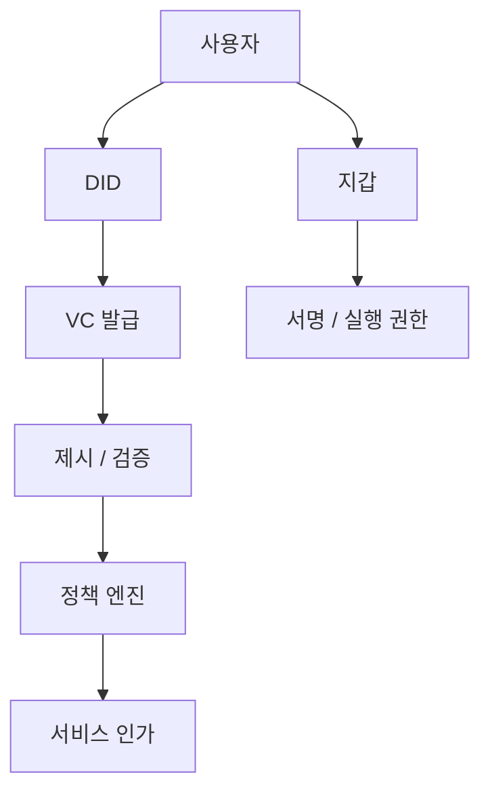

# DID, VC, 정책 자동화

## 문서 목적

세미나 3단계의 핵심 질문인 `신원 증명과 서비스 인가를 어떤 정책으로 자동화할 것인가`를 중심으로 DID, VC, SSI를 정리한다.

## 핵심 요약

- DID는 식별자 체계, VC는 자격 증명 형식, SSI는 이를 운영하는 모델로 이해하는 편이 명확하다.
- 서비스 설계에서는 발급, 제시, 검증, 폐기 흐름을 정책 레이어와 함께 설계해야 한다.
- 지갑과 계정만으로는 조직 소속, 자격, 역할 기반 접근 제어를 충분히 설명하기 어렵다.
- 공공/기업 서비스 문맥에서는 신원과 권한을 분리해서 모델링하는 것이 중요하다.

## 관계 지도

## 구성 요소를 구분해서 보기

DID는 식별자, VC는 증명 형식, SSI는 사용자 중심 운영 모델이다. 서비스는 보통 아래처럼 나눈다.

- 자산 이동과 실행: 지갑과 계정
- 신원 식별: DID
- 자격 증명: VC
- 접근 정책: 발급 조건, 검증 규칙, 만료 및 폐기 규칙

## 왜 이 구분이 중요한가

서비스는 아래 요구를 동시에 가진다.

- 자산 소유권을 증명해야 한다
- 특정 조직 구성원인지 증명해야 한다
- 특정 역할 또는 자격을 증명해야 한다
- 개인정보는 최소한만 노출해야 한다

지갑 서명만으로는 마지막 세 문제를 깔끔하게 풀기 어렵다. 세미나 3단계는 이 지점을 다룬다.

## 세미나 관점 메모

- 발표에서는 DID/VC/SSI를 각각 다른 문제를 푸는 계층으로 나눠 설명하는 편이 낫다.
- 정책 자동화라는 표현을 같이 써야 서비스 인가 구조와 연결된다.
- 공공/기업 시나리오에서는 발급-제시-검증-폐기 흐름을 한 장의 다이어그램으로 보여 주는 것이 좋다.

## 선행 개념

- [하이브리드 아키텍처](/patterns/hybrid-architecture)

## 다음으로 읽을 문서

- [스마트월렛과 계정 추상화](/patterns/smart-wallet-and-account-abstraction)
- [Enterprise Adoption Patterns](/operations/enterprise-adoption-patterns)

## 관련 문서

- [AI + Web3 Convergence](/lab/ai-and-web3-convergence)
- [읽기 순서와 핵심 메시지](/seminar/reading-path-and-core-messages)
*** Add File: /Users/ryan9kim/내 드라이브/Obsidian/Vault/1. PROJECT/👨‍💼🔍📝 리서치/Web3 Tech 리서치/Web3-Tech-Handbook/docs/patterns/smart-wallet-and-account-abstraction.md
---
title: "스마트월렛과 계정 추상화"
description: "사용자 UX와 위임 실행 관점에서 스마트월렛과 계정 추상화를 설명한다."
level: advanced
category: patterns
status: stable
tags:
  - smart-wallet
  - account-abstraction
  - ux
---

# 스마트월렛과 계정 추상화

## 문서 목적

세미나 4단계의 핵심인 `가스와 키 복잡성을 얼마나 서비스 안으로 흡수할 수 있는가`를 중심으로 스마트월렛과 계정 추상화 구조를 정리한다.

## 핵심 요약

- 스마트월렛은 사용자 계정을 더 유연한 정책 실행 단위로 바꾸려는 접근이다.
- 계정 추상화는 서명, 수수료 부담, 복구, 위임 실행을 더 세밀하게 설계할 수 있게 한다.
- 핵심은 기술 명칭보다 `누가 비용을 내고 누가 실행 권한을 갖는가`를 어떻게 설계하느냐다.

## 주요 설계 질문

- 가스 대납은 누가 어떤 조건에서 부담하는가
- 위임 실행은 어느 범위까지 허용하는가
- 키 분실 시 복구 정책은 어떻게 둘 것인가
- 사용자에게 어떤 복잡성을 숨기고 어떤 책임은 남길 것인가

## 선행 개념

- [계정, 상태, 트랜잭션, 확정성](/foundations/accounts-state-transactions-and-finality)
- [DID, VC, 정책 자동화](/patterns/did-vc-and-policy)

## 다음으로 읽을 문서

- [자산, 정산, 권리 구조](/patterns/assets-settlement-and-rights)
- [스테이블코인 결제와 CCTP](/patterns/stablecoin-settlement-and-cctp)

## 관련 문서

- [하이브리드 아키텍처](/patterns/hybrid-architecture)
- [Enterprise Adoption Patterns](/operations/enterprise-adoption-patterns)
*** Delete File: /Users/ryan9kim/내 드라이브/Obsidian/Vault/1. PROJECT/👨‍💼🔍📝 리서치/Web3 Tech 리서치/Web3-Tech-Handbook/docs/patterns/assets-settlement-and-rights.md
