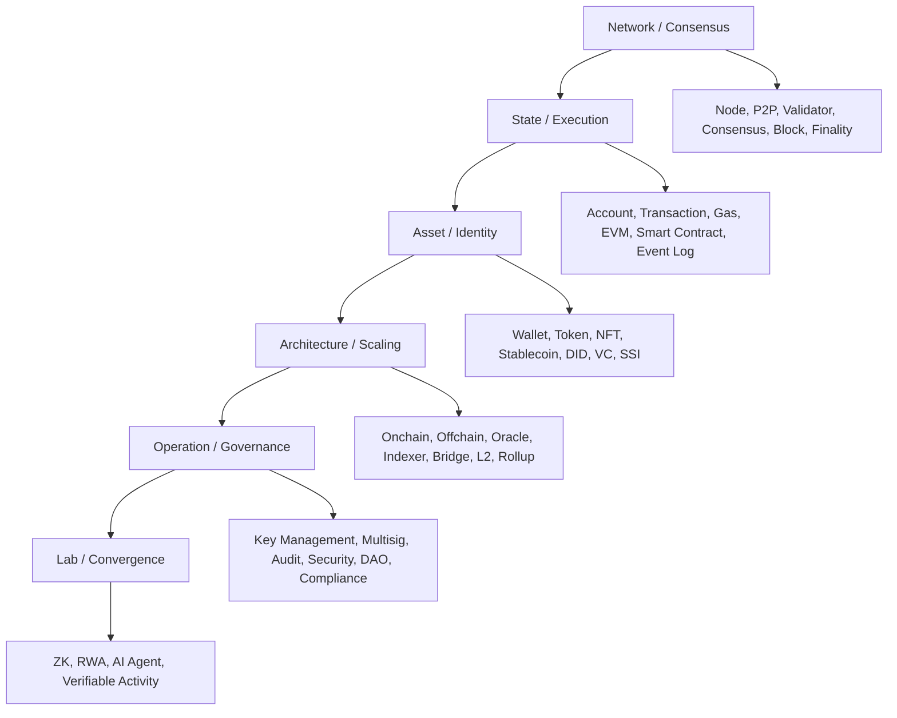

# 블록체인과 Web3 키워드 지도

## 목적

이 문서는 블록체인과 Web3를 처음 접하거나, 발표 전에 전체 지형을 빠르게 정리해야 할 때 사용하는 키워드 지도다. 개별 용어의 자세한 정의는 [개념 레퍼런스](/reference/glossary)에서 확인하고, 이 문서에서는 개념들이 어떤 계층으로 연결되는지 먼저 잡는다.

핸드북의 기본 관점은 단순하다. 블록체인은 `공유 상태를 검증하는 인프라`이고, Web3는 그 인프라를 바탕으로 `소유권`, `권한`, `정산`, `신원`, `실행`, `감사 가능성`을 설계하는 방식이다.

## 한 문장 정의

|구분|핵심 정의|초점|
|---|---|---|
|Blockchain|여러 참여자가 상태 전이 기록을 공유하고 검증하는 분산 시스템|합의, 상태, 트랜잭션, 최종성|
|Web3|검증 가능한 상태와 권한을 활용해 소유, 실행, 정산, 신원을 재설계하는 기술 패러다임|검증 가능성, 지갑, 스마트컨트랙트, 토큰, 신원, 거버넌스|
|Crypto|암호학, 경제적 인센티브, 네트워크 효과가 결합된 공개형 프로토콜 생태계|자산, 보상, 시장 구조, 프로토콜 운영|
|Enterprise Web3|공개 검증성과 내부 운영 시스템을 조합해 업무 증빙과 정산 신뢰를 높이는 적용 방식|하이브리드 아키텍처, 감사 trail, 책임 추적|

## 계층별 키워드 지도

## 1. Network / Consensus

블록체인의 가장 아래 계층은 네트워크와 합의다. 이 계층은 누가 기록을 만들고, 어떤 기록이 유효하며, 언제 운영상 확정됐다고 볼지를 결정한다.

|키워드|의미|읽을 문서|
|---|---|---|
|Node|블록과 트랜잭션을 검증하고 네트워크에 참여하는 실행 단위|[계정, 상태, 트랜잭션, 확정성](/foundations/accounts-state-transactions-and-finality)|
|P2P Network|중앙 서버 없이 참여자 간 메시지를 전파하는 네트워크 구조|[신뢰 인프라의 진화](/foundations/)|
|Validator / Miner|블록 생성과 검증에 참여하는 주체|[신뢰 인프라의 진화](/foundations/)|
|Consensus|네트워크가 같은 상태를 인정하도록 만드는 절차|[계정, 상태, 트랜잭션, 확정성](/foundations/accounts-state-transactions-and-finality)|
|Block|트랜잭션 묶음과 이전 기록의 연결 정보를 담는 단위|[계정, 상태, 트랜잭션, 확정성](/foundations/accounts-state-transactions-and-finality)|
|Finality|거래 결과를 운영상 되돌리기 어렵다고 판단하는 기준|[계정, 상태, 트랜잭션, 확정성](/foundations/accounts-state-transactions-and-finality)|
|Reorg|이미 관측한 블록이나 상태가 더 우선되는 체인에 의해 바뀌는 상황|[계정, 상태, 트랜잭션, 확정성](/foundations/accounts-state-transactions-and-finality)|

핵심 질문은 `이 상태를 누가 인정했는가`, `얼마나 되돌리기 어려운가`, `후속 업무를 실행해도 되는 시점인가`이다.

## 2. State / Execution

블록체인은 데이터를 저장하는 장부이기도 하지만, 더 정확하게는 상태 전이를 검증하는 실행 환경이다. Web3 서비스 설계에서는 계정, 트랜잭션, 실행 비용, 이벤트 로그가 하나의 흐름으로 연결된다.

|키워드|의미|읽을 문서|
|---|---|---|
|State|시스템이 현재 사실로 인정하는 값의 집합|[계정, 상태, 트랜잭션, 확정성](/foundations/accounts-state-transactions-and-finality)|
|Account|상태와 권한이 연결된 행위 주체|[계정, 상태, 트랜잭션, 확정성](/foundations/accounts-state-transactions-and-finality)|
|Transaction|상태 변경을 요청하는 서명된 행위|[계정, 상태, 트랜잭션, 확정성](/foundations/accounts-state-transactions-and-finality)|
|Gas / Fee|상태 전이와 계산 자원 사용에 대한 비용 모델|[스마트컨트랙트는 정책 집행 계층이다](/foundations/smart-contracts-as-policy)|
|EVM|이더리움 계열 스마트컨트랙트를 실행하는 가상머신 모델|[스마트컨트랙트는 정책 집행 계층이다](/foundations/smart-contracts-as-policy)|
|Smart Contract|상태 전이 규칙을 공개 검증 가능한 방식으로 실행하는 프로그램|[스마트컨트랙트는 정책 집행 계층이다](/foundations/smart-contracts-as-policy)|
|Event Log|컨트랙트 실행 결과를 외부 시스템이 읽을 수 있게 남기는 기록|[스마트컨트랙트는 정책 집행 계층이다](/foundations/smart-contracts-as-policy)|

핵심 질문은 `어떤 상태를 체인에 남길 것인가`, `어떤 규칙을 공개 실행할 것인가`, `외부 시스템은 어떤 이벤트를 기준으로 반응해야 하는가`이다.

## 3. Asset / Identity

Web3가 응용 계층에서 강력해지는 지점은 자산과 신원을 상태 모델로 다룰 수 있다는 점이다. 토큰은 소유권과 권리를 표현하고, 지갑과 DID/VC는 권한과 자격을 표현한다.

|키워드|의미|읽을 문서|
|---|---|---|
|Wallet|키와 서명 권한을 관리하고 계정 행위를 실행하는 사용자 도구|[스마트월렛과 계정 추상화](/patterns/smart-wallet-and-account-abstraction)|
|Account Abstraction|수수료, 복구, 위임, 정책을 계정 레벨에서 유연하게 구성하는 접근|[스마트월렛과 계정 추상화](/patterns/smart-wallet-and-account-abstraction)|
|Token|자산, 권리, 보상, 거버넌스를 상태 모델로 표현한 것|[자산, 정산, 권리 구조](/patterns/assets-settlement-and-rights)|
|NFT|고유 자산이나 고유 권리를 표현하는 토큰 모델|[자산, 정산, 권리 구조](/patterns/assets-settlement-and-rights)|
|Stablecoin|가치가 법정화폐나 특정 자산에 연동되도록 설계된 토큰|[스테이블코인 결제와 CCTP](/patterns/stablecoin-settlement-and-cctp)|
|DID|특정 중앙기관에 덜 종속적인 식별자를 만들려는 접근|[DID, VC, 정책 자동화](/patterns/did-vc-and-policy)|
|VC|검증 가능한 자격 정보를 표현하는 데이터 형식|[DID, VC, 정책 자동화](/patterns/did-vc-and-policy)|
|SSI|사용자가 자신의 신원 정보와 자격 증명을 더 직접적으로 통제하려는 모델|[DID, VC, 정책 자동화](/patterns/did-vc-and-policy)|

핵심 질문은 `이 사용자가 누구인가`보다 `이 계정이 어떤 권한을 증명할 수 있는가`, `이 자산과 권리는 어떤 상태로 표현되는가`이다.

## 4. Architecture / Scaling

실무 Web3 시스템은 대부분 하이브리드 구조다. 모든 데이터를 온체인에 올리는 것이 아니라, 공동 검증이 필요한 상태와 내부 처리에 남겨도 되는 데이터를 구분한다.

|키워드|의미|읽을 문서|
|---|---|---|
|Onchain|상태와 실행 결과를 블록체인에 직접 남기는 설계 영역|[온체인, 오프체인, 앵커링, 하이브리드](/foundations/onchain-offchain-design-patterns)|
|Offchain|블록체인 밖에서 데이터 저장, 계산, 워크플로를 처리하는 영역|[온체인, 오프체인, 앵커링, 하이브리드](/foundations/onchain-offchain-design-patterns)|
|Anchoring|원문 데이터는 오프체인에 두고 해시나 요약만 온체인에 기록하는 패턴|[온체인, 오프체인, 앵커링, 하이브리드](/foundations/onchain-offchain-design-patterns)|
|Oracle|체인 밖의 데이터를 체인 실행에 연결하는 구성 요소|[하이브리드 아키텍처](/patterns/hybrid-architecture)|
|Indexer|온체인 이벤트와 상태를 조회하기 쉬운 형태로 재구성하는 구성 요소|[하이브리드 아키텍처](/patterns/hybrid-architecture)|
|Bridge|서로 다른 체인 사이에서 자산이나 메시지를 이동시키는 구조|[멀티체인과 상호운용](/patterns/multichain-and-interoperability)|
|L2 / Rollup|거래 실행을 별도 계층에서 처리하고 결과를 기준 체인에 정산하는 확장 구조|[멀티체인과 상호운용](/patterns/multichain-and-interoperability)|
|Chain Abstraction|여러 체인의 차이를 사용자와 서비스 로직에 덜 노출하는 설계 방향|[멀티체인과 상호운용](/patterns/multichain-and-interoperability)|

핵심 질문은 `무엇을 공유 검증 영역에 둘 것인가`, `무엇은 성능과 개인정보를 위해 오프체인에 둘 것인가`, `두 영역의 증빙을 어떻게 연결할 것인가`이다.

## 5. Operation / Governance

Web3 시스템의 난점은 기술 구현보다 운영 책임에서 자주 드러난다. 키 관리, 배포 권한, 컨트랙트 업그레이드, 감사, 거버넌스, 장애 대응 기준이 없으면 검증 가능한 인프라도 서비스 리스크를 줄이지 못한다.

|키워드|의미|읽을 문서|
|---|---|---|
|Key Management|서명 키와 복구 권한을 안전하게 관리하는 운영 체계|[스마트월렛과 계정 추상화](/patterns/smart-wallet-and-account-abstraction)|
|Multisig / MPC|단일 키 실패를 줄이기 위해 여러 승인자나 분산 키 관리를 사용하는 방식|[스마트컨트랙트 보안 운영](/operations/smart-contract-security-operations)|
|Audit|컨트랙트, 권한, 이벤트, 운영 절차를 검토하고 증빙하는 과정|[스마트컨트랙트 보안 운영](/operations/smart-contract-security-operations)|
|Governance|정책 변경, 업그레이드, 자금 집행, 예외 처리를 결정하는 구조|[DAO-lite 거버넌스](/operations/dao-lite-governance)|
|DAO-lite|온체인 투표와 오프체인 집행을 섞어 쓰는 현실형 거버넌스 모델|[DAO-lite 거버넌스](/operations/dao-lite-governance)|
|Compliance|규제, 회계, 개인정보, 책임 소재를 운영 기준에 반영하는 체계|[Enterprise Adoption Patterns](/operations/enterprise-adoption-patterns)|
|RWA Governance|현실 자산의 발행자, 수탁자, 준비금, 증빙, 권리 행사를 연결하는 운영 구조|[RWA와 데이터 증명](/lab/rwa-data-proofs)|

핵심 질문은 `누가 변경할 수 있는가`, `누가 승인해야 하는가`, `무엇이 기록으로 남는가`, `문제가 생겼을 때 책임과 복구 절차는 어디에 있는가`이다.

## 6. Lab / Convergence

Lab 영역은 아직 표준 패턴으로 고정되지 않았지만, Web3의 다음 적용 범위를 가늠하게 하는 주제를 다룬다. 핵심은 새 기술 자체가 아니라 `검증 가능한 권한과 행동 기록`이 어디까지 확장되는지다.

|키워드|의미|읽을 문서|
|---|---|---|
|ZK|원문을 공개하지 않고도 특정 사실이 참임을 증명하는 암호학적 접근|[ZK와 선택적 공개](/lab/zk-selective-disclosure)|
|RWA|현실 세계 자산을 토큰 또는 검증 가능한 권리 상태로 연결하는 접근|[RWA와 데이터 증명](/lab/rwa-data-proofs)|
|AI Agent|목표를 받아 도구 호출, 계획, 실행을 수행하는 AI 기반 행위자|[AI + Web3 Convergence](/lab/ai-and-web3-convergence)|
|Agent Wallet|AI Agent가 제한된 권한과 예산 안에서 서명하거나 결제하도록 하는 지갑 구조|[에이전트 권한과 지갑](/lab/agent-wallet-permissions)|
|Verifiable Activity|에이전트나 시스템의 행위를 검증 가능한 기록으로 남기는 구조|[검증 가능한 에이전트 행동 기록](/lab/verifiable-agent-activity)|

핵심 질문은 `자동화된 행위자의 권한을 어떻게 제한할 것인가`, `행동 기록을 누가 검증할 수 있는가`, `프라이버시를 유지하면서도 필요한 사실을 어떻게 증명할 것인가`이다.

## 혼동하기 쉬운 개념쌍

|개념쌍|구분 기준|
|---|---|
|Blockchain vs Web3|Blockchain은 상태 검증 인프라이고, Web3는 그 인프라를 활용한 권한·자산·신원·실행 설계 방식이다.|
|Decentralization vs Verifiability|탈중앙은 운영 주체 분산의 정도이고, 검증 가능성은 외부 참여자가 상태와 행위를 확인할 수 있는 성질이다.|
|Wallet vs Account|지갑은 키와 서명 UX를 다루는 도구이고, 계정은 체인 상태와 연결된 행위 주체다.|
|Coin vs Token|Coin은 보통 네트워크 기본 자산이고, Token은 컨트랙트나 상태 모델로 표현된 자산·권리다.|
|Smart Contract vs Backend|스마트컨트랙트는 공개 검증 가능한 상태 전이를 담당하고, 백엔드는 데이터 처리, UX, 통합, 운영 워크플로를 담당한다.|
|Onchain vs Offchain|온체인은 공동 검증이 필요한 상태를 남기고, 오프체인은 성능·개인정보·운영 유연성이 필요한 처리를 담당한다.|
|Finality vs Confirmation|Confirmation은 블록 포함 이후 누적 확인의 정도이고, Finality는 운영상 결과를 확정해도 되는 기준이다.|
|DID vs Wallet Address|DID는 식별자와 자격 증명 체계를 다루고, 지갑 주소는 특정 체인 계정의 주소다.|
|Bridge vs CCTP|Bridge는 일반적인 체인 간 자산·메시지 이동 구조이고, CCTP는 특정 스테이블코인의 발행·소각 기반 전송 모델이다.|
|DAO vs DAO-lite|DAO는 온체인 거버넌스 원칙을 강하게 적용한 조직 모델이고, DAO-lite는 온체인 의사결정과 오프체인 책임 집행을 조합한 현실형 모델이다.|

## 세미나용 5문장 요약

1. 블록체인은 거래 데이터를 저장하는 기술을 넘어, 여러 참여자가 같은 상태를 검증하도록 만드는 인프라다.
2. Web3는 이 검증 가능한 상태를 바탕으로 소유권, 권한, 정산, 신원, 실행 규칙을 재설계하는 접근이다.
3. 실무 Web3 시스템은 대부분 온체인과 오프체인을 조합하는 하이브리드 구조로 구현된다.
4. 중요한 설계 질문은 `어떤 체인을 쓸 것인가`보다 `무엇을 누구에게 검증 가능하게 만들 것인가`이다.
5. 현재 Web3의 진화 방향은 탈중앙 구호에서 검증 가능성, 운영 책임, 제도권 연결, AI Agent 권한 관리로 이동하고 있다.

## 다음에 읽을 문서

처음부터 흐름을 따라가려면 [신뢰 인프라의 진화: Bitcoin에서 RWA까지](/foundations/)를 읽는다. 핵심 관점을 먼저 잡으려면 [Web3를 다시 정의하기: 탈중앙에서 검증가능성으로](/foundations/web3-overview)를 읽는다. 개별 용어를 다시 확인해야 한다면 [개념 레퍼런스](/reference/glossary)를 사용한다.
