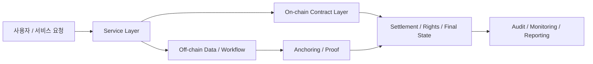

# 용어사전

## 목적

핸드북 전반에서 반복적으로 등장하는 용어를 짧고 일관된 정의로 정리한다.

## 주요 용어

|용어|설명|
|---|---|
|블록체인|상태 전이 기록을 여러 참여자가 공유하고 검증하는 분산 시스템|
|합의|어떤 상태 전이가 유효한지 네트워크 참여자가 같은 결론에 도달하도록 만드는 절차|
|최종성|이미 반영된 거래를 충분히 되돌리기 어렵다고 볼 수 있는 성질|
|지갑|서명 권한과 자산 접근을 관리하는 사용자 도구|
|계정|체인 상태와 연결된 행위 주체|
|DID|특정 네트워크에 덜 종속적인 식별자를 제공하려는 접근|
|VC|검증 가능한 자격 정보를 표현하는 데이터 형식|
|SSI|사용자가 자신의 신원 정보와 자격 증명을 더 직접적으로 통제하려는 모델|
|스마트컨트랙트|검증 가능한 규칙으로 실행되는 프로그램|
|토큰|자산, 권리, 보상, 거버넌스를 표현하는 상태 모델|
|계정 추상화|사용자 계정의 서명, 복구, 실행 정책을 더 유연하게 구성하려는 접근|
|체인 추상화|여러 체인을 사용하는 복잡성을 사용자에게 덜 노출하려는 설계 방향|
|앵커링|원문 데이터는 오프체인에 두고 해시나 요약만 온체인에 기록하는 패턴|
|하이브리드 아키텍처|실행은 오프체인 중심으로 두고 정산, 증빙, 권리 상태만 온체인에 두는 패턴|
|CCTP|체인 간 스테이블코인 이동과 정산을 단순화하려는 전송 모델을 가리킬 때 자주 쓰이는 용어|
|DAO-lite|기업·공공 환경에 맞게 온체인 투표와 오프체인 집행을 섞어 쓰는 거버넌스 모델|

## 관련 문서

- [Web3 개요와 철학](/foundations/web3-overview)
- [하이브리드 아키텍처](/patterns/hybrid-architecture)
- [읽기 순서와 핵심 메시지](/seminar/reading-path-and-core-messages)
*** Add File: /Users/ryan9kim/내 드라이브/Obsidian/Vault/1. PROJECT/👨‍💼🔍📝 리서치/Web3 Tech 리서치/Web3-Tech-Handbook/docs/foundations/onchain-offchain-design-patterns.md
---
title: "온체인 vs 오프체인 설계 패턴"
description: "Full on-chain, anchoring, hybrid 패턴을 기준으로 경계 판단 방법을 정리한다."
level: foundation
category: foundations
status: stable
tags:
  - onchain
  - offchain
  - hybrid
---

# 온체인 vs 오프체인 설계 패턴

## 문서 목적

Web3 기본기 세미나의 핵심 산출물인 온체인/오프체인 경계 판단 기준을 handbook 문서로 정리한다.

## 핵심 요약

- Web3 설계의 핵심 질문은 `무엇을 온체인에 둘 것인가`보다 `무엇을 검증 가능하게 만들 것인가`에 가깝다.
- 대표 패턴은 `Full on-chain`, `Anchoring`, `Hybrid` 세 가지로 나눠 볼 수 있다.
- 비용, 성능, 프라이버시, 감사 가능성의 trade-off로 패턴을 선택해야 한다.

## 패턴 비교

|패턴|설명|권장 상황|
|---|---|---|
|Full on-chain|로직과 핵심 데이터를 온체인 중심으로 처리|강한 투명성과 공통 검증이 우선일 때|
|Anchoring|원문은 오프체인에 두고 해시나 요약만 온체인 기록|원문 보관 부담이 크지만 무결성 증명이 필요할 때|
|Hybrid|실행은 오프체인, 정산/권리/증빙은 온체인|성능과 신뢰를 함께 요구할 때|

## 판단 기준

1. 위변조 방지가 핵심 요구인가
2. 다자간 신뢰 정렬이 필요한가
3. 사후 감사 추적이 필수인가
4. 비용과 지연을 감수할 가치가 있는가

## 세미나 관점 메모

- 이 문서는 1회차 세미나의 산출물 기준으로 쓰기 좋다.
- 팀 토론에서는 기능 1개를 골라 세 패턴 중 어떤 구조가 맞는지 설명해 보는 방식이 유효하다.
- 이 문서는 2회차 하이브리드 아키텍처 세션의 선행 문서다.

## 선행 개념

- [Web3 개요와 철학](/foundations/web3-overview)
- [계정, 상태, 트랜잭션, 확정성](/foundations/accounts-state-transactions-and-finality)

## 다음으로 읽을 문서

- [하이브리드 아키텍처](/patterns/hybrid-architecture)
- [Enterprise Adoption Patterns](/operations/enterprise-adoption-patterns)

## 관련 문서

- [자산, 정산, 권리 구조](/patterns/assets-settlement-and-rights)
- [8단계 세미나 로드맵](/seminar/web3-upskilling-roadmap)
*** Add File: /Users/ryan9kim/내 드라이브/Obsidian/Vault/1. PROJECT/👨‍💼🔍📝 리서치/Web3 Tech 리서치/Web3-Tech-Handbook/docs/patterns/index.md
---
title: "설계 패턴"
description: "중급·고급 영역에서 반복적으로 재사용되는 Web3 실무 패턴을 정리한다."
---

# 설계 패턴

## 카테고리 목적

이 챕터는 팀 세미나의 2~6단계를 handbook용 문서 묶음으로 재구성한 것이다. 세부 기술별 top-level 폴더 대신, 서비스 설계에서 반복적으로 재사용되는 패턴 단위로 정리해 이후 개편에도 강한 결합이 생기지 않도록 한다.

## 권장 읽기 순서

1. [하이브리드 아키텍처](/patterns/hybrid-architecture)
2. [DID, VC, 정책 자동화](/patterns/did-vc-and-policy)
3. [스마트월렛과 계정 추상화](/patterns/smart-wallet-and-account-abstraction)
4. [자산, 정산, 권리 구조](/patterns/assets-settlement-and-rights)
5. [스테이블코인 결제와 CCTP](/patterns/stablecoin-settlement-and-cctp)
6. [멀티체인과 상호운용](/patterns/multichain-and-interoperability)

## 선행 챕터

- [기초와 입문](/foundations/)

## 다음 카테고리

- [운영과 거버넌스](/operations/)
- [세미나](/seminar/)
*** Add File: /Users/ryan9kim/내 드라이브/Obsidian/Vault/1. PROJECT/👨‍💼🔍📝 리서치/Web3 Tech 리서치/Web3-Tech-Handbook/docs/patterns/hybrid-architecture.md
---
title: "하이브리드 아키텍처"
description: "온체인과 오프체인의 경계를 실제 서비스 아키텍처 문서 수준으로 구체화한다."
level: advanced
category: patterns
status: stable
tags:
  - hybrid
  - architecture
  - adr
---

# 하이브리드 아키텍처

## 문서 목적

세미나 2단계의 핵심인 하이브리드 아키텍처 판단 기준을 handbook용 문서로 정리한다.

## 핵심 요약

- 하이브리드 아키텍처는 기술 타협안이 아니라 실무에서 가장 자주 선택되는 기본 패턴이다.
- 핵심은 온체인, 오프체인, 앵커링의 책임을 명확히 나누는 것이다.
- 서비스 설계는 ADR, 운영 관측성, 보안, 회계/정산 연결까지 함께 다뤄야 한다.

## 구조 개요

## 설계 질문

- 어떤 상태만 온체인에 두면 충분한가
- 어떤 원문은 오프체인에 남겨야 하는가
- 해시 또는 증빙을 언제 기록하는가
- 장애와 재시도는 누가 책임지는가

## 산출물 관점 메모

세미나 2단계에서는 아래와 같은 문서가 결과물로 나오면 좋다.

1. 아키텍처 원페이저
2. 온/오프/앵커링 경계 다이어그램
3. 운영·보안 런북 초안

## 선행 개념

- [온체인 vs 오프체인 설계 패턴](/foundations/onchain-offchain-design-patterns)

## 다음으로 읽을 문서

- [DID, VC, 정책 자동화](/patterns/did-vc-and-policy)
- [스테이블코인 결제와 CCTP](/patterns/stablecoin-settlement-and-cctp)

## 관련 문서

- [Enterprise Adoption Patterns](/operations/enterprise-adoption-patterns)
- [8단계 세미나 로드맵](/seminar/web3-upskilling-roadmap)
*** Delete File: /Users/ryan9kim/내 드라이브/Obsidian/Vault/1. PROJECT/👨‍💼🔍📝 리서치/Web3 Tech 리서치/Web3-Tech-Handbook/docs/patterns/did-vc-and-policy.md
