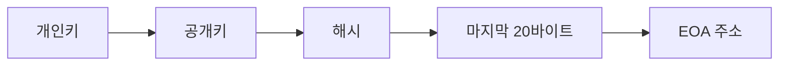

# Web3 입문 FAQ

## 목적

Web3를 처음 접할 때 가장 많이 생기는 질문은 `이론적으로 가능한가`, `현실적으로 위험한가`, `사용자가 무엇을 조심해야 하는가`가 섞여 있다. 이 문서는 주소, 키, 지갑, 서명, 가스, 트랜잭션, 보안 공격에 대한 기본 질문을 빠르게 정리한다.

핵심 기준은 다음과 같다.

- 암호학적으로 가능한 것과 현실적인 공격 가능성은 구분한다.
- 사용자가 직접 이해해야 하는 부분과 제품이 흡수해야 하는 책임을 구분한다.
- 단편 지식보다 실제 사용자가 만나는 위험과 확인 절차를 우선한다.

## 빠른 요약

|질문|짧은 답|
|---|---|
|EOA 주소를 브루트포스로 뚫을 수 있는가?|현실적으로 불가능하다. 개인키 공간은 약 `2^256` 규모다.|
|EOA 주소 개수는 얼마나 되는가?|Ethereum 주소는 160비트이므로 가능한 주소는 `2^160`, 약 `1.46 x 10^48`개다.|
|랜덤 주소 충돌은 가능한가?|이론상 가능하지만 현실적으로 무시할 수 있을 만큼 작다.|
|Address Poisoning Attack은 무엇인가?|공격자가 비슷해 보이는 주소를 거래 내역에 남겨 사용자가 잘못 복사하게 만드는 공격이다.|
|지갑 연결은 로그인과 같은가?|비슷해 보이지만 주소 노출, 세션 생성, 권한 요청의 시작점이 될 수 있다.|
|서명은 안전한가?|서명 종류와 내용에 따라 다르다. 메시지 서명, 토큰 승인, 트랜잭션 확인은 의미가 다르다.|
|가스비는 왜 필요한가?|네트워크 자원을 쓰는 비용이며, 스팸 방지와 실행 우선순위 조정 역할도 한다.|
|잘못 보낸 트랜잭션은 취소 가능한가?|이미 확정된 트랜잭션은 일반적으로 되돌릴 수 없다.|

## 주소와 키

### EOA 주소란 무엇인가?

EOA는 `Externally Owned Account`의 약자다. 사용자의 개인키로 통제되는 계정이다. Ethereum 계열에서 사용자가 보는 주소는 보통 `0x`로 시작하는 20바이트, 즉 160비트 값이다.

개념적으로는 아래 흐름으로 이해하면 된다.



중요한 점은 주소가 계정의 공개 식별자이고, 개인키가 통제 권한이라는 점이다. 주소를 안다고 해서 계정을 통제할 수는 없다.

### 브루트포스로 개인키를 찾아낼 수 있는가?

현실적으로 불가능하다.

Ethereum EOA는 secp256k1 타원곡선 기반 개인키를 사용한다. 가능한 개인키 공간은 대략 `2^256` 규모다. 이는 약 `1.16 x 10^77` 수준의 거대한 공간이다. 단순히 빠른 컴퓨터를 많이 동원한다고 해서 유의미하게 탐색할 수 있는 범위가 아니다.

실제 위험은 개인키 자체를 수학적으로 찾아내는 브루트포스보다 아래에서 훨씬 자주 발생한다.

- 시드 구문을 피싱 사이트에 입력
- 악성 지갑 앱 또는 브라우저 확장 설치
- 클립보드 주소 변조 악성코드 감염
- 무제한 토큰 승인
- 복구 구문을 클라우드, 메신저, 이메일에 평문 저장
- 하드웨어 월렛 확인 화면을 제대로 검토하지 않음

따라서 보안의 초점은 `개인키를 누가 계산해낼까`보다 `개인키와 서명 권한이 어떻게 노출될까`에 맞춰야 한다.

### 이론상 가능한 EOA 주소의 개수는 몇 개인가?

Ethereum 주소는 160비트이므로 가능한 주소 개수는 다음과 같다.

```text
2^160 = 1,461,501,637,330,902,918,203,684,832,716,283,019,655,932,542,976
```

약 `1.46 x 10^48`개다.

이는 지구상의 사람 수, 서버 수, 생성 가능한 일반 계정 수와 비교하기 어려울 정도로 큰 수다. 그래서 정상적인 난수 생성기를 사용해 주소를 만들면, 다른 사용자의 주소와 우연히 겹칠 가능성은 현실적으로 무시할 수 있다.

### 주소 충돌은 가능한가?

이론상 가능하다. 주소는 160비트이고 개인키 공간은 그보다 훨씬 크기 때문에, 서로 다른 개인키가 같은 주소로 이어지는 경우는 수학적으로 존재할 수 있다.

하지만 현실적인 공격 가능성과는 다르다. 특정 주소와 같은 주소를 만드는 개인키를 찾는 것은 160비트 수준의 preimage 탐색 문제로 볼 수 있으며, 현실적인 계산 자원으로는 불가능한 영역이다.

무작위로 생성한 주소끼리 우연히 충돌할 확률도 극히 작다. 근사적으로 `n`개의 주소를 만들 때 충돌 확률은 아래와 같이 볼 수 있다.

```text
n^2 / (2 x 2^160)
```

예를 들어 무작위 주소를 10억 개 만든다고 해도 충돌 확률은 대략 `3.4 x 10^-31` 수준이다. 이는 현실적인 운영 리스크로 보기 어렵다.

### 그럼 왜 주소가 비슷해 보이는 경우가 있는가?

완전히 같은 주소가 아니라, 앞뒤 일부 문자열이 비슷한 주소를 의도적으로 만든 경우가 많다. 공격자는 주소 전체를 맞추지 않아도 된다. 사용자가 보통 주소의 앞 4-6자리와 뒤 4-6자리만 확인한다는 점을 노린다.

이런 방식이 Address Poisoning Attack의 핵심이다.

## Address Poisoning Attack

### Address Poisoning Attack이란 무엇인가?

Address Poisoning Attack은 공격자가 피해자 지갑의 거래 내역에 `비슷해 보이는 주소`를 남겨 사용자가 다음 송금 때 잘못 복사하게 만드는 공격이다.

예시는 다음과 같다.

```text
정상 주소: 0xA13f...91cB
공격 주소: 0xA13f...91dB
```

사용자가 거래 내역에서 주소의 앞뒤 일부만 보고 복사하면 공격자 주소로 자산을 보낼 수 있다.

### 공격자는 어떻게 내 거래 내역에 주소를 남기는가?

공격자는 피해자 주소로 아주 작은 금액의 토큰을 보내거나, 가치 없는 토큰 전송 기록을 만들거나, 특정 컨트랙트 이벤트를 이용해 지갑과 블록 익스플로러의 거래 내역에 공격자 주소가 보이게 만들 수 있다.

사용자는 실제로 거래한 적 없는 주소를 거래 내역에서 보고 “이전에 보낸 주소”라고 착각할 수 있다.

### 어떻게 방어해야 하는가?

가장 중요한 방어는 거래 내역에서 주소를 복사하지 않는 것이다.

권장 기준은 다음과 같다.

- 주소록, allowlist, 검증된 contact 기능을 사용한다.
- 주소의 앞뒤 몇 자리만 보지 말고 전체 주소를 확인한다.
- 큰 금액 송금 전에는 저장된 주소와 목적지를 다시 확인한다.
- 하드웨어 월렛을 사용할 때는 기기 화면의 주소를 확인한다.
- ENS 같은 이름 서비스도 문자 유사성, 도메인 착각, 소유권 변경 가능성을 함께 고려한다.
- 조직 송금은 2인 확인, 출금 allowlist, 지연 출금 정책을 둔다.

테스트 송금은 도움이 될 수 있지만 만능은 아니다. 공격자는 테스트 이후에도 유사 주소를 거래 내역에 남길 수 있다. 핵심은 `거래 내역 복사`가 아니라 `검증된 주소 원천`을 쓰는 것이다.

## 지갑과 계정

### 지갑은 계정인가?

완전히 같은 말은 아니다.

계정은 체인 상태와 연결된 행위 주체다. 지갑은 계정의 키와 서명 권한을 관리하고, 사용자가 트랜잭션을 만들고 서명하게 해주는 도구다.

```text
계정 = 체인에서 상태를 갖는 주체
주소 = 계정의 공개 식별자
개인키 = 계정을 통제하는 비밀 값
지갑 = 키와 서명 행위를 관리하는 앱 또는 장치
```

그래서 “지갑을 잃었다”는 말은 실제로는 지갑 앱을 잃은 것인지, 시드 구문을 잃은 것인지, 개인키가 노출된 것인지 구분해야 한다.

### 시드 구문과 개인키는 무엇이 다른가?

시드 구문은 보통 12개 또는 24개 단어로 된 복구 문구다. 이 시드 구문에서 여러 개인키와 계정 주소를 파생할 수 있다.

개인키는 특정 계정을 통제하는 비밀 값이다. 시드 구문은 여러 개인키를 만들 수 있는 상위 복구 재료로 이해하면 된다.

따라서 시드 구문이 노출되면 그 시드에서 파생된 여러 계정이 위험해질 수 있다.

### 지갑을 연결하면 자산이 바로 위험해지는가?

지갑 연결 자체만으로 자산이 자동 이동하는 것은 아니다. 하지만 주소가 공개되고, 서비스와 세션이 만들어지고, 이후 서명 또는 승인 요청으로 이어질 수 있다.

위험은 연결 그 자체보다 이후 단계에 있다.

- 어떤 메시지에 서명하는가
- 어떤 토큰을 approve하는가
- approve 범위가 제한되어 있는가
- 어떤 컨트랙트에 트랜잭션을 보내는가
- 서명 요청이 실제 접속한 도메인과 일치하는가

## 서명과 승인

### Sign message와 Confirm transaction은 무엇이 다른가?

`Sign message`는 특정 메시지에 대해 내 계정이 동의했다는 증명이다. 상태 변경이 바로 발생하지 않을 수도 있다.

`Confirm transaction`은 실제 체인 상태 변경 요청에 서명하는 것이다. 가스비가 발생하고, 성공하면 체인 상태가 바뀐다.

하지만 메시지 서명도 안전하다고 단정하면 안 된다. 일부 서명은 인증, 위임, 주문, 권한 부여에 사용될 수 있다. 사용자는 화면에 보이는 문장을 읽고, 어떤 도메인과 어떤 목적의 서명인지 확인해야 한다.

### Approve는 왜 위험한가?

토큰 approve는 특정 컨트랙트가 내 토큰을 이동할 수 있도록 권한을 주는 행위다. 특히 `unlimited approval`은 컨트랙트가 허용 범위 안에서 반복적으로 토큰을 가져갈 수 있는 구조를 만들 수 있다.

권장 기준은 다음과 같다.

- 필요한 수량만 approve한다.
- 사용 후 revoke 기능으로 승인 권한을 회수한다.
- 낯선 dApp에 unlimited approval을 주지 않는다.
- 지갑의 transaction simulation 또는 risk warning을 확인한다.
- 큰 자산은 별도 보관 지갑에 둔다.

### 하드웨어 월렛을 쓰면 모든 위험이 사라지는가?

아니다.

하드웨어 월렛은 개인키가 일반 PC나 모바일 기기 밖으로 노출되는 위험을 크게 줄인다. 하지만 사용자가 하드웨어 월렛 화면에서 잘못된 주소나 잘못된 트랜잭션을 승인하면 위험은 여전히 남는다.

하드웨어 월렛은 `키 보호 장치`이지, 모든 서명 의미를 자동으로 판단해주는 장치는 아니다.

## 트랜잭션과 가스

### 트랜잭션은 언제 되돌릴 수 없는가?

트랜잭션이 블록에 포함되고 충분히 확정되면 일반적으로 되돌릴 수 없다. 블록체인은 고객센터가 임의로 거래를 취소하는 구조가 아니다.

다만 서비스 레벨에서는 보상, 환불, 재정산, 반대 방향의 보정 트랜잭션을 설계할 수 있다. 이것은 체인 트랜잭션을 되돌리는 것이 아니라, 별도 정책으로 후속 처리를 하는 것이다.

### pending 트랜잭션은 취소할 수 있는가?

체인과 지갑에 따라 다르지만, Ethereum 계열에서는 같은 nonce를 사용해 더 높은 가스비의 다른 트랜잭션을 보내 pending 트랜잭션을 대체하는 방식이 가능하다.

다만 이는 이미 확정된 거래를 취소하는 것이 아니다. 아직 블록에 포함되지 않은 대기 상태의 요청을 다른 요청으로 바꾸는 방식이다.

### 가스비는 왜 계속 변하는가?

가스비는 네트워크 자원 사용 비용이다. 네트워크 혼잡도, 트랜잭션 우선순위, 실행 복잡도에 따라 달라진다.

가스비는 단순 수수료가 아니라 다음 역할을 한다.

- 네트워크 자원 사용량을 가격으로 조절한다.
- 스팸 트랜잭션을 어렵게 만든다.
- 혼잡 시 어떤 트랜잭션을 먼저 처리할지 우선순위를 만든다.
- 복잡한 컨트랙트 실행에 더 많은 비용을 부과한다.

사용자 경험 관점에서는 가스비가 큰 진입 장벽이다. 그래서 smart wallet, paymaster, gas sponsorship 같은 설계가 등장했다.

### 트랜잭션이 실패해도 가스비가 나가는 이유는 무엇인가?

트랜잭션이 실패해도 네트워크는 검증과 실행 시도를 수행한다. 따라서 이미 사용한 계산 자원에 대한 비용은 지불된다.

즉 가스비는 “성공 수수료”가 아니라 “네트워크 자원 사용료”에 가깝다.

## 보안과 사기

### 피싱 사이트는 어떻게 구분해야 하는가?

가장 중요한 것은 도메인과 서명 요청을 함께 보는 것이다.

확인 기준은 다음과 같다.

- URL 철자와 도메인을 확인한다.
- 광고 링크보다 공식 문서, 공식 소셜, 저장된 북마크를 우선한다.
- 지갑 팝업의 요청 내용을 읽는다.
- 갑자기 지갑 연결, 메시지 서명, approve를 요구하는 사이트는 의심한다.
- “보상 수령”, “긴급 마이그레이션”, “계정 인증”을 이유로 시드 구문을 요구하면 즉시 중단한다.

정상 서비스는 시드 구문을 요구하지 않는다.

### 클립보드 주소 변조 공격은 무엇인가?

악성코드가 사용자가 복사한 지갑 주소를 공격자의 주소로 바꾸는 공격이다. 사용자는 정상 주소를 복사했다고 생각하지만, 붙여넣기 결과는 다른 주소가 될 수 있다.

방어 기준은 다음과 같다.

- 붙여넣은 뒤 주소 전체 또는 충분한 길이를 다시 확인한다.
- 큰 금액은 하드웨어 월렛 화면에서 주소를 확인한다.
- 주소록과 allowlist를 사용한다.
- 감염 가능성이 있는 PC에서 고액 송금을 하지 않는다.

### Dusting attack은 무엇인가?

Dusting attack은 아주 작은 금액의 토큰이나 코인을 여러 주소에 보내 사용자의 주소 활동을 추적하거나, 거래 내역을 혼란스럽게 만드는 방식이다.

Dust 자체가 항상 직접적인 자산 탈취로 이어지는 것은 아니다. 하지만 주소 추적, 피싱 유도, address poisoning과 결합될 수 있다.

낯선 토큰을 받았다고 해서 반드시 상호작용할 필요는 없다. 특히 낯선 토큰을 claim하거나 swap하라고 유도하는 링크는 주의해야 한다.

### Rug pull은 무엇인가?

Rug pull은 프로젝트 운영자나 공격자가 유동성, 자산, 권한을 회수해 참여자에게 손실을 주는 행위다.

확인할 지점은 다음과 같다.

- 유동성 lock 여부
- owner 권한과 upgrade 권한
- mint 권한
- pause, blacklist, transfer restriction
- multisig와 governance 구조
- 외부 감사 여부와 감사 범위

감사 보고서가 있다고 해서 안전이 보장되는 것은 아니다. 감사 범위, 버전, 수정 반영 여부를 함께 봐야 한다.

### “에어드롭을 받으려면 서명하라”는 요청은 안전한가?

항상 위험하다고 단정할 수는 없지만, 주의해야 한다.

정상적인 에어드롭 claim도 서명이나 트랜잭션을 요구할 수 있다. 문제는 공격자가 이 흐름을 악용한다는 점이다.

확인 기준은 다음과 같다.

- 공식 도메인인지 확인한다.
- 시드 구문을 요구하면 즉시 중단한다.
- 단순 claim인지, token approve인지, 알 수 없는 contract call인지 확인한다.
- 큰 자산이 있는 지갑으로 실험하지 않는다.
- 가능하면 별도 저위험 지갑을 사용한다.

## 실무와 학습

### Web3에서 가장 먼저 배워야 할 개념은 무엇인가?

입문자는 아래 순서로 배우는 것이 좋다.

1. 주소, 계정, 지갑, 개인키, 시드 구문
2. 트랜잭션, 서명, 가스, nonce, 확정성
3. 스마트컨트랙트와 토큰 approve
4. 온체인과 오프체인 설계 차이
5. 지갑 UX와 account abstraction
6. 보안 운영과 권한 관리

다음 문서를 이어서 읽으면 된다.

- [블록체인과 Web3 키워드 지도](/reference/blockchain-web3-map)
- [계정, 상태, 트랜잭션, 확정성](/foundations/accounts-state-transactions-and-finality)
- [스마트월렛과 계정 추상화](/patterns/smart-wallet-and-account-abstraction)
- [스마트컨트랙트 보안 운영](/operations/smart-contract-security-operations)

### Web3 서비스 설계에서 가장 중요한 질문은 무엇인가?

“무엇을 온체인에 올릴까?”보다 “무엇을 누구에게 검증 가능하게 만들까?”가 더 중요하다.

검토 질문은 다음과 같다.

- 누가 어떤 상태를 검증해야 하는가?
- 사용자가 직접 책임져야 하는 것은 무엇인가?
- 제품이 흡수해야 하는 책임은 무엇인가?
- 서명과 권한 범위를 사용자가 이해할 수 있는가?
- 키 분실, 장치 분실, 피싱, 오입금에 대한 대응 정책이 있는가?
- 운영자가 가진 admin key와 upgrade 권한은 어떻게 통제되는가?

### 입문자에게 가장 중요한 보안 습관은 무엇인가?

아래 다섯 가지를 우선한다.

1. 시드 구문은 절대 입력하거나 공유하지 않는다.
2. 주소는 거래 내역에서 복사하지 말고 검증된 주소록에서 가져온다.
3. 서명 요청은 `Connect`, `Sign`, `Approve`, `Confirm`을 구분한다.
4. 큰 자산은 일상 사용 지갑과 분리한다.
5. 낯선 토큰, 낯선 링크, 급한 보상 claim 요청에는 상호작용하지 않는다.

## 다음으로 읽을 문서

- [블록체인과 Web3 키워드 지도](/reference/blockchain-web3-map)
- [계정, 상태, 트랜잭션, 확정성](/foundations/accounts-state-transactions-and-finality)
- [스마트월렛과 계정 추상화](/patterns/smart-wallet-and-account-abstraction)
- [스마트컨트랙트 보안 운영](/operations/smart-contract-security-operations)
